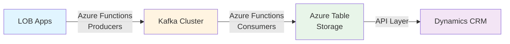
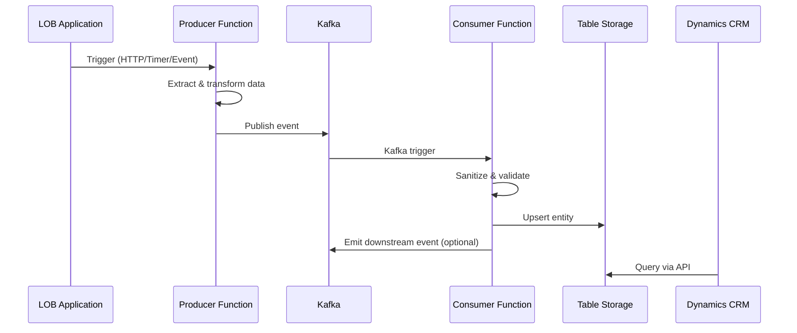
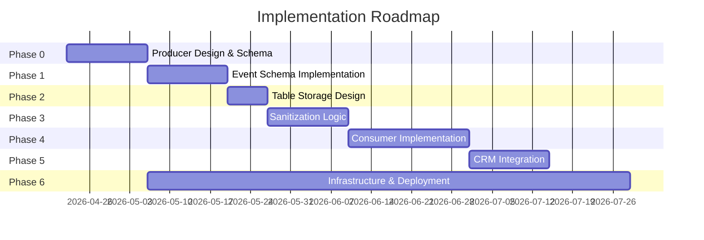

# Kafka-Based LOB Data Integration to Azure Table Storage

## System Specification Overview

### Purpose

This specification defines the architecture and implementation details for consolidating data from multiple line-of-business (LOB) applications through Apache Kafka into Azure Table Storage, ultimately feeding Microsoft Dynamics CRM.

### Architecture Overview

### System Components

1. **Producers (Azure Functions)** - Extract data from LOB systems and publish events to Kafka
2. **Kafka Cluster** - Durable, partitioned event streaming backbone
3. **Consumers (Azure Functions)** - Subscribe to Kafka topics, sanitize data, write to Table Storage
4. **Azure Table Storage** - Consolidated NoSQL data store optimized for CRM queries
5. **API Layer** - REST/OData endpoints for CRM integration
6. **Dynamics CRM** - Consumes unified data view

### LOB Domain Coverage

- **Inventory Management** - Stock levels, transfers, transactions
- **Order Management** - Orders, line items, payments, shipments
- **Customer Management** - Customer profiles, addresses, contact history
- **Product Catalog** - Products, variants, categories, attributes
- **Pricing** - Prices, discounts, promotions

### Event Flow

### Specification Documents

This specification is organized into the following sections:

#### Phase 0: Producers

- [Producer Function App Topology](producers/function-app-topology.md)
- [Producer Trigger Patterns](producers/trigger-patterns.md)
- [Kafka Output Configuration](producers/kafka-output-config.md)
- [LOB Integration Patterns](producers/lob-integration.md)
- [Producer Error Handling](producers/error-handling.md)

#### Phase 1: Schemas

- [Event Envelope Schema](schemas/event-envelope.md)
- [Inventory Event Schemas](schemas/inventory-events.md)
- [Order Event Schemas](schemas/orders-events.md)
- [Customer Event Schemas](schemas/customers-events.md)
- [Product Event Schemas](schemas/products-events.md)
- [Pricing Event Schemas](schemas/pricing-events.md)
- [Kafka Topic Map](schemas/kafka-topic-map.md)
- [Data Quality Issues](schemas/data-quality-issues.md)

#### Phase 2: Table Storage

- [Table Storage Schema Design](table-storage/schema-design.md)
- [Entity Mapping](table-storage/entity-mapping.md)
- [Query Patterns](table-storage/query-patterns.md)

#### Phase 3: Sanitization

- [Pipeline Architecture](sanitization/pipeline-architecture.md)
- [Validation Rules](sanitization/validation-rules.md)
- [Cleansing Rules](sanitization/cleansing-rules.md)
- [Transformation Mappings](sanitization/transformation-mappings.md)
- [Error Handling](sanitization/error-handling.md)

#### Phase 4: Consumers

- [Consumer Function App Topology](consumers/function-app-topology.md)
- [Kafka Trigger Configuration](consumers/kafka-trigger-config.md)
- [Function Bindings](consumers/function-bindings.md)
- [Idempotency Strategy](consumers/idempotency-strategy.md)
- [Retry and DLQ Policies](consumers/retry-dlq-policies.md)
- [Scaling Strategy](consumers/scaling-strategy.md)
- [Observability](consumers/observability.md)

#### Phase 5: CRM Integration

- [API Design](crm-integration/api-design.md)
- [Entity Mapping](crm-integration/entity-mapping.md)
- [Sync Strategy](crm-integration/sync-strategy.md)
- [Conflict Resolution](crm-integration/conflict-resolution.md)
- [Audit Trail](crm-integration/audit-trail.md)

#### Phase 6: Infrastructure

- [Kafka Cluster Specification](infrastructure/kafka-cluster-spec.md)
- [Azure Table Storage Configuration](infrastructure/azure-storage-config.md)
- [Function App Hosting](infrastructure/function-app-hosting.md)
- [Deployment Architecture](infrastructure/deployment-architecture.md)
- [Security Design](infrastructure/security-design.md)
- [Networking](infrastructure/networking.md)
- [Monitoring & Alerting](infrastructure/monitoring-alerting.md)
- [CI/CD Pipelines](infrastructure/cicd-pipelines.md)

### Key Design Decisions

| Decision Area       | Choice                       | Rationale                                                    |
| ------------------- | ---------------------------- | ------------------------------------------------------------ |
| Producer Technology | Azure Functions              | Serverless, multiple trigger types, native Kafka output      |
| Consumer Technology | Azure Functions              | Native Kafka triggers, auto-scaling, Application Insights    |
| Event Serialization | JSON Schema                  | Human-readable, wide tooling support, adequate performance   |
| NoSQL Database      | Azure Table Storage          | Cost-effective, simple key-value, adequate for CRM queries   |
| Kafka Platform      | TBD: Event Hubs vs Confluent | Event Hubs for Azure-native, Confluent for advanced features |
| Hosting Plan        | TBD: Premium recommended     | VNet integration, no cold start, consistent performance      |

### Implementation Phases

### Assumptions

- Common LOB applications: inventory management, order management, customer management, product catalog, pricing
- Target NoSQL: Azure Table Storage (cost-effective, simple key-value store)
- Producer implementation: Azure Functions with various triggers (HTTP, Timer, Event Grid, Service Bus)
- Consumer implementation: Azure Functions with Kafka triggers
- Project phase: POC/Early design - exploring feasibility and architecture
- Producer apps: Existing LOB systems that need integration via Functions

### Scope

**Included:**

- Event schema design
- Sanitization patterns
- Table Storage schema
- Consumer architecture
- CRM integration patterns
- Infrastructure specifications

**Excluded:**

- Actual implementation code
- Specific producer integration details
- CRM customization details
- Load testing execution
- Production deployment

### Next Steps

1. Review and approve this specification structure
2. Decide on Kafka platform (Event Hubs for Kafka vs Confluent Cloud)
3. Decide on Function App hosting plan (Consumption vs Premium vs Dedicated)
4. Define performance requirements (message volume, latency SLAs)
5. Proceed with detailed design for each phase
