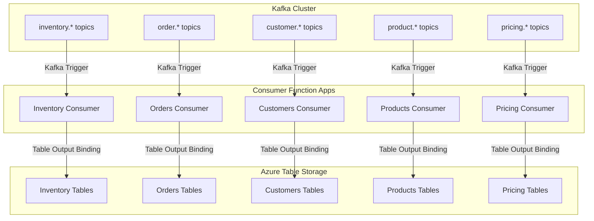
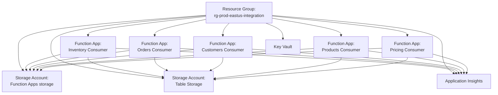

# Consumer Function App Topology

## Overview

Consumer Azure Functions subscribe to Kafka topics, sanitize data, and write to Azure Table Storage. This document defines the organization and structure of consumer Function Apps.

## Topology Architecture



## Recommended Topology: One Function App per Domain

### Structure

```
func-{environment}-{region}-{domain}-consumer

Examples:
- func-prod-eastus-inventory-consumer
- func-prod-eastus-orders-consumer
- func-prod-eastus-customers-consumer
- func-prod-eastus-products-consumer
- func-prod-eastus-pricing-consumer
```

### Rationale

| Benefit                     | Description                                           |
| --------------------------- | ----------------------------------------------------- |
| **Independent Scaling**     | Each domain scales based on its own throughput        |
| **Failure Isolation**       | Issues in one domain don't affect others              |
| **Deployment Independence** | Deploy updates per domain without affecting others    |
| **Clear Ownership**         | Teams can own specific domains                        |
| **Resource Limits**         | Avoid hitting Function App limits (200 functions max) |

## Function Organization Within Each App

### Inventory Consumer Function App

```
func-prod-eastus-inventory-consumer/
├── InventoryItemCreatedConsumer.cs      (inventory.item.created)
├── InventoryItemUpdatedConsumer.cs      (inventory.item.updated)
├── InventoryTransferCreatedConsumer.cs  (inventory.transfer.created)
├── InventoryTransferShippedConsumer.cs  (inventory.transfer.shipped)
└── InventoryTransferReceivedConsumer.cs (inventory.transfer.received)
```

### Orders Consumer Function App

```
func-prod-eastus-orders-consumer/
├── OrderCreatedConsumer.cs              (order.order.created)
├── OrderUpdatedConsumer.cs              (order.order.updated)
├── PaymentCapturedConsumer.cs           (order.payment.captured)
├── ShipmentShippedConsumer.cs           (order.shipment.shipped)
└── ShipmentDeliveredConsumer.cs         (order.shipment.delivered)
```

## Consumer Function Pattern

### Basic Structure

```csharp
public class InventoryItemUpdatedConsumer
{
    private readonly ILogger<InventoryItemUpdatedConsumer> _logger;
    private readonly IDataSanitizer _sanitizer;
    private readonly IInventoryMapper _mapper;

    public InventoryItemUpdatedConsumer(
        ILogger<InventoryItemUpdatedConsumer> logger,
        IDataSanitizer sanitizer,
        IInventoryMapper mapper)
    {
        _logger = logger;
        _sanitizer = sanitizer;
        _mapper = mapper;
    }

    [Function("InventoryItemUpdated")]
    public async Task Run(
        [KafkaTrigger(
            topic: "inventory.item.updated",
            BrokerList = "%KafkaBootstrapServers%",
            ConnectionStringSetting = "KafkaConnectionString",
            ConsumerGroup = "inventory-writer",
            Protocol = BrokerProtocol.SaslSsl,
            AuthenticationMode = BrokerAuthenticationMode.Plain
        )] KafkaEventData<string> kafkaEvent,
        [TableOutput("InventoryItems", Connection = "TableStorageConnection")]
        IAsyncCollector<InventoryItemEntity> tableOutput)
    {
        var correlationId = Activity.Current?.Id ?? Guid.NewGuid().ToString();

        try
        {
            // 1. Deserialize envelope
            var envelope = JsonSerializer.Deserialize<EventEnvelope<InventoryUpdatedEvent>>(
                kafkaEvent.Value);

            _logger.LogInformation(
                "Processing inventory.item.updated for {ItemId}, Correlation: {CorrelationId}",
                envelope.Payload.InventoryItemId,
                envelope.CorrelationId);

            // 2. Sanitize data
            var sanitized = await _sanitizer.SanitizeInventoryUpdateAsync(envelope.Payload);

            // 3. Transform to Table Storage entity
            var entity = _mapper.MapToTableEntity(sanitized);

            // 4. Write to Table Storage
            await tableOutput.AddAsync(entity);

            _logger.LogInformation(
                "Successfully processed inventory.item.updated for {ItemId}",
                envelope.Payload.InventoryItemId);
        }
        catch (Exception ex)
        {
            _logger.LogError(ex,
                "Failed to process inventory.item.updated, Correlation: {CorrelationId}",
                correlationId);
            throw; // Let Functions runtime handle retry/DLQ
        }
    }
}
```

## Resource Organization



## Configuration

### Application Settings (per Consumer Function App)

```json
{
  "KafkaBootstrapServers": "@Microsoft.KeyVault(SecretUri=https://...)",
  "KafkaConnectionString": "@Microsoft.KeyVault(SecretUri=https://...)",
  "TableStorageConnection": "@Microsoft.KeyVault(SecretUri=https://...)",
  "APPINSIGHTS_INSTRUMENTATIONKEY": "@Microsoft.KeyVault(SecretUri=https://...)",
  "FUNCTIONS_WORKER_RUNTIME": "dotnet-isolated",
  "WEBSITE_RUN_FROM_PACKAGE": "1"
}
```

### Consumer Group per Function App

| Function App       | Consumer Group     | Purpose                               |
| ------------------ | ------------------ | ------------------------------------- |
| Inventory Consumer | `inventory-writer` | Write inventory data to Table Storage |
| Orders Consumer    | `orders-writer`    | Write order data to Table Storage     |
| Customers Consumer | `customers-writer` | Write customer data to Table Storage  |
| Products Consumer  | `products-writer`  | Write product data to Table Storage   |
| Pricing Consumer   | `pricing-writer`   | Write pricing data to Table Storage   |

## Scaling Strategy

### KEDA-Based Scaling (Premium/Dedicated Plan)

Consumer Functions scale based on Kafka consumer lag:

```yaml
apiVersion: keda.sh/v1alpha1
kind: ScaledObject
metadata:
  name: inventory-consumer-scaler
spec:
  scaleTargetRef:
    name: inventory-consumer-function-app
  minReplicaCount: 2
  maxReplicaCount: 20
  triggers:
    - type: kafka
      metadata:
        topic: inventory.item.updated
        bootstrapServers: kafka-broker:9092
        consumerGroup: inventory-writer
        lagThreshold: "100"
```

### Consumption Plan Scaling

Automatically scales based on:

- Number of partitions
- Consumer lag
- Event rate

Default limits:

- Max 200 instances per Function App
- Scales one instance per partition (up to partition count)

## Deployment Slots

Each consumer Function App should have:

- **Production slot** - Live traffic
- **Staging slot** - Pre-production testing with separate consumer groups

```
Production Consumer Group: inventory-writer
Staging Consumer Group: inventory-writer-staging
```

## Multi-Topic Subscription (Alternative Pattern)

Instead of one function per topic, consolidate related topics:

```csharp
[Function("InventoryEventsConsumer")]
public async Task Run(
    [KafkaTrigger(
        topic: "inventory.item.created,inventory.item.updated,inventory.item.deleted",
        BrokerList = "%KafkaBootstrapServers%",
        ConnectionStringSetting = "KafkaConnectionString",
        ConsumerGroup = "inventory-writer"
    )] KafkaEventData<string> kafkaEvent,
    [TableOutput("InventoryItems", ...)] IAsyncCollector<InventoryItemEntity> tableOutput)
{
    var envelope = JsonSerializer.Deserialize<EventEnvelope<JsonElement>>(kafkaEvent.Value);

    switch (envelope.EventType)
    {
        case "inventory.item.created":
            await HandleCreatedAsync(envelope, tableOutput);
            break;
        case "inventory.item.updated":
            await HandleUpdatedAsync(envelope, tableOutput);
            break;
        case "inventory.item.deleted":
            await HandleDeletedAsync(envelope, tableOutput);
            break;
        default:
            _logger.LogWarning("Unknown event type: {EventType}", envelope.EventType);
            break;
    }
}
```

**Trade-offs:**

- ✅ Fewer functions to manage
- ❌ All topics scale together
- ❌ More complex error handling

## Best Practices

### 1. Idempotent Processing

```csharp
// Check if already processed using ETag
var existingEntity = await tableClient.GetEntityIfExistsAsync<InventoryItemEntity>(
    partitionKey, rowKey);

if (existingEntity.HasValue)
{
    // Update using ETag for optimistic concurrency
    entity.ETag = existingEntity.Value.ETag;
    await tableClient.UpdateEntityAsync(entity, ETag.All, TableUpdateMode.Replace);
}
else
{
    await tableClient.AddEntityAsync(entity);
}
```

### 2. Structured Logging

```csharp
_logger.LogInformation(
    "Processing {EventType} for {EntityId}, Correlation: {CorrelationId}, Attempt: {Attempt}",
    envelope.EventType,
    entity.RowKey,
    envelope.CorrelationId,
    executionContext.RetryContext?.RetryCount ?? 0);
```

### 3. Metrics Tracking

```csharp
_telemetry.TrackMetric("consumer.processed", 1, new Dictionary<string, string>
{
    ["Domain"] = "inventory",
    ["EventType"] = envelope.EventType,
    ["Topic"] = "inventory.item.updated"
});
```

### 4. Error Handling

See [Retry and DLQ Policies](retry-dlq-policies.md) for detailed error handling patterns.

## Monitoring

### Key Metrics per Consumer

- Consumer lag (messages behind)
- Processing rate (messages/second)
- Error rate (failed messages)
- Processing duration (milliseconds)
- Table Storage write latency

### Application Insights Queries

```kusto
// Consumer lag by domain
customMetrics
| where name == "consumer.lag"
| summarize avg(value), max(value) by bin(timestamp, 5m), tostring(customDimensions.Domain)

// Processing errors
exceptions
| where cloud_RoleName contains "consumer"
| summarize ErrorCount = count() by bin(timestamp, 5m), tostring(customDimensions.EventType)
```

## Security

- **Managed Identity** for accessing Key Vault, Storage, Event Hubs
- **VNet Integration** (Premium plan) for private connectivity
- **Secrets in Key Vault** - No connection strings in configuration
- **Least Privilege** - Consumer-specific RBAC roles on Table Storage
