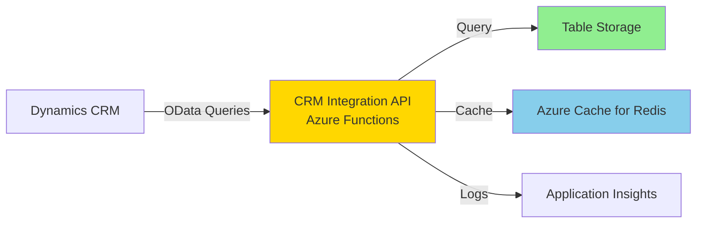
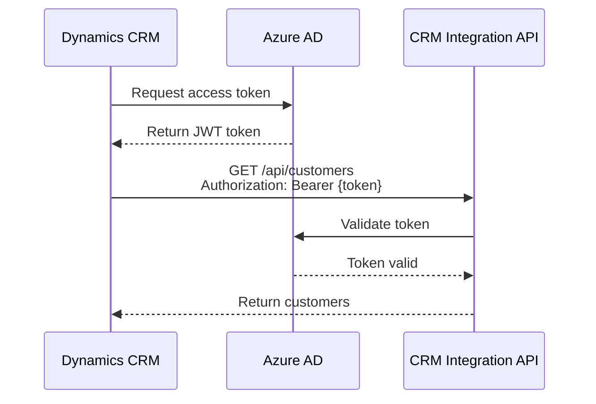

# CRM Integration API Design

## Overview

The CRM Integration API provides a REST/OData interface for Dynamics CRM to query consolidated data from Azure Table Storage. This API abstracts Table Storage complexities and provides CRM-optimized query patterns.

## API Architecture



## Technology Stack

| Component          | Technology                    | Reason                       |
| ------------------ | ----------------------------- | ---------------------------- |
| **API Framework**  | Azure Functions HTTP Triggers | Serverless, auto-scaling     |
| **Query Language** | OData v4                      | Standard for Dynamics CRM    |
| **Authentication** | Azure AD OAuth 2.0            | Secure, token-based          |
| **Caching**        | Azure Cache for Redis         | Reduce Table Storage queries |
| **Serialization**  | JSON                          | CRM-native format            |

## API Endpoints

### Base URL

```
https://func-prod-eastus-crm-api.azurewebsites.net/api
```

### Endpoint Inventory

| Endpoint          | Method | Description              | OData Support                           |
| ----------------- | ------ | ------------------------ | --------------------------------------- |
| `/customers`      | GET    | List customers           | $filter, $select, $top, $skip, $orderby |
| `/customers/{id}` | GET    | Get customer by ID       | $expand                                 |
| `/orders`         | GET    | List orders              | $filter, $select, $top, $skip, $orderby |
| `/orders/{id}`    | GET    | Get order by ID          | $expand                                 |
| `/inventory`      | GET    | List inventory items     | $filter, $select, $top, $skip, $orderby |
| `/inventory/{id}` | GET    | Get inventory item by ID | -                                       |
| `/products`       | GET    | List products            | $filter, $select, $top, $skip, $orderby |
| `/products/{id}`  | GET    | Get product by ID        | -                                       |
| `/health`         | GET    | Health check             | -                                       |

## OData Query Examples

### Customers Endpoint

#### Get All Customers (Paginated)

```http
GET /api/customers?$top=50&$skip=0
```

Response:

```json
{
  "@odata.context": "https://func-prod-eastus-crm-api.azurewebsites.net/api/$metadata#customers",
  "@odata.count": 5432,
  "value": [
    {
      "customerId": "CUST-12345",
      "firstName": "John",
      "lastName": "Doe",
      "email": "john.doe@example.com",
      "phone": "+14155551234",
      "customerType": "Retail",
      "status": "Active",
      "totalLifetimeValue": 12500.00,
      "totalOrders": 15,
      "averageOrderValue": 833.33,
      "loyaltyTier": "Gold",
      "createdDate": "2023-01-15T08:30:00Z",
      "lastPurchaseDate": "2024-11-20T14:22:00Z"
    },
    ...
  ],
  "@odata.nextLink": "https://func-prod-eastus-crm-api.azurewebsites.net/api/customers?$top=50&$skip=50"
}
```

#### Filter by Status

```http
GET /api/customers?$filter=status eq 'Active'&$select=customerId,firstName,lastName,email
```

#### Filter by Loyalty Tier

```http
GET /api/customers?$filter=loyaltyTier eq 'Gold' or loyaltyTier eq 'Platinum'&$orderby=totalLifetimeValue desc
```

#### Search by Email

```http
GET /api/customers?$filter=contains(email,'example.com')
```

### Orders Endpoint

#### Get Recent Orders

```http
GET /api/orders?$filter=orderDate gt 2024-01-01&$orderby=orderDate desc&$top=100
```

#### Get Orders for Customer (with Expand)

```http
GET /api/customers/CUST-12345/orders?$expand=lineItems,payments
```

Response:

```json
{
  "@odata.context": "https://func-prod-eastus-crm-api.azurewebsites.net/api/$metadata#orders",
  "value": [
    {
      "orderId": "ORD-98765",
      "customerId": "CUST-12345",
      "orderDate": "2024-11-20T14:22:00Z",
      "status": "Delivered",
      "totalAmount": 149.99,
      "lineItems": [
        {
          "lineNumber": 1,
          "productId": "PROD-001",
          "sku": "WIDGET-001",
          "quantity": 2,
          "unitPrice": 49.99,
          "lineTotal": 99.98
        },
        {
          "lineNumber": 2,
          "productId": "PROD-002",
          "sku": "GADGET-002",
          "quantity": 1,
          "unitPrice": 50.01,
          "lineTotal": 50.01
        }
      ],
      "payments": [
        {
          "paymentId": "PAY-12345",
          "paymentMethod": "CreditCard",
          "amount": 149.99,
          "status": "Captured",
          "transactionDate": "2024-11-20T14:23:00Z"
        }
      ]
    }
  ]
}
```

#### Get Pending Orders

```http
GET /api/orders?$filter=status eq 'Pending' or status eq 'Processing'
```

### Inventory Endpoint

#### Get Low Stock Items

```http
GET /api/inventory?$filter=quantityAvailable le reorderPoint&$select=inventoryItemId,sku,quantityAvailable,reorderPoint,locationId
```

#### Get Inventory by Location

```http
GET /api/inventory?$filter=locationId eq 'WAREHOUSE-01'&$orderby=sku
```

## Function Implementation

### Customers API Function

```csharp
public class CustomersApi
{
    private readonly ILogger<CustomersApi> _logger;
    private readonly TableClient _customersTable;
    private readonly IODataQueryParser _queryParser;
    private readonly IDistributedCache _cache;

    public CustomersApi(
        ILogger<CustomersApi> logger,
        TableClient customersTable,
        IODataQueryParser queryParser,
        IDistributedCache cache)
    {
        _logger = logger;
        _customersTable = customersTable;
        _queryParser = queryParser;
        _cache = cache;
    }

    [Function("GetCustomers")]
    [OpenApiOperation(operationId: "GetCustomers", tags: new[] { "Customers" })]
    [OpenApiParameter(name: "$filter", In = ParameterLocation.Query, Required = false, Type = typeof(string))]
    [OpenApiParameter(name: "$select", In = ParameterLocation.Query, Required = false, Type = typeof(string))]
    [OpenApiParameter(name: "$top", In = ParameterLocation.Query, Required = false, Type = typeof(int))]
    [OpenApiParameter(name: "$skip", In = ParameterLocation.Query, Required = false, Type = typeof(int))]
    [OpenApiParameter(name: "$orderby", In = ParameterLocation.Query, Required = false, Type = typeof(string))]
    [OpenApiResponseWithBody(statusCode: HttpStatusCode.OK, contentType: "application/json", bodyType: typeof(ODataResponse<CustomerDto>))]
    public async Task<IActionResult> GetCustomers(
        [HttpTrigger(AuthorizationLevel.Anonymous, "get", Route = "customers")] HttpRequest req)
    {
        var correlationId = req.Headers["X-Correlation-ID"].FirstOrDefault() ?? Guid.NewGuid().ToString();

        try
        {
            // Parse OData query parameters
            var queryOptions = _queryParser.Parse(req.Query);

            // Check cache
            var cacheKey = $"customers:{queryOptions.GetCacheKey()}";
            var cachedResult = await _cache.GetStringAsync(cacheKey);
            if (!string.IsNullOrEmpty(cachedResult))
            {
                _logger.LogInformation("Cache hit for {CacheKey}", cacheKey);
                return new OkObjectResult(cachedResult);
            }

            // Build Table Storage filter
            var filter = BuildTableStorageFilter(queryOptions.Filter);

            // Query Table Storage
            var customers = new List<CustomerEntity>();
            await foreach (var customer in _customersTable.QueryAsync<CustomerEntity>(filter: filter))
            {
                customers.Add(customer);
            }

            // Apply client-side filtering (for complex OData filters)
            customers = ApplyODataFilters(customers, queryOptions);

            // Get total count (before pagination)
            var totalCount = customers.Count;

            // Apply pagination
            var skip = queryOptions.Skip ?? 0;
            var top = queryOptions.Top ?? 50;
            var pagedCustomers = customers.Skip(skip).Take(top).ToList();

            // Map to DTOs
            var dtos = pagedCustomers.Select(c => MapToDto(c)).ToList();

            // Build OData response
            var response = new ODataResponse<CustomerDto>
            {
                Context = $"{req.Scheme}://{req.Host}/api/$metadata#customers",
                Count = totalCount,
                Value = dtos
            };

            // Add next link if more results
            if (skip + top < totalCount)
            {
                response.NextLink = $"{req.Scheme}://{req.Host}/api/customers?$top={top}&$skip={skip + top}";
            }

            // Cache result
            await _cache.SetStringAsync(cacheKey, JsonSerializer.Serialize(response),
                new DistributedCacheEntryOptions
                {
                    AbsoluteExpirationRelativeToNow = TimeSpan.FromMinutes(5)
                });

            _logger.LogInformation(
                "Returned {Count} customers (of {Total}), Correlation: {CorrelationId}",
                dtos.Count,
                totalCount,
                correlationId);

            return new OkObjectResult(response);
        }
        catch (Exception ex)
        {
            _logger.LogError(ex, "Error getting customers, Correlation: {CorrelationId}", correlationId);
            return new StatusCodeResult(StatusCodes.Status500InternalServerError);
        }
    }

    [Function("GetCustomerById")]
    public async Task<IActionResult> GetCustomerById(
        [HttpTrigger(AuthorizationLevel.Anonymous, "get", Route = "customers/{id}")] HttpRequest req,
        string id)
    {
        try
        {
            // Determine partition key (first 2 chars of customer ID)
            var partitionKey = id.Substring(0, 2);

            var customer = await _customersTable.GetEntityAsync<CustomerEntity>(
                partitionKey: partitionKey,
                rowKey: id);

            return new OkObjectResult(MapToDto(customer.Value));
        }
        catch (Azure.RequestFailedException ex) when (ex.Status == 404)
        {
            return new NotFoundResult();
        }
    }

    private CustomerDto MapToDto(CustomerEntity entity)
    {
        return new CustomerDto
        {
            CustomerId = entity.CustomerId,
            CustomerNumber = entity.CustomerNumber,
            CustomerType = entity.CustomerType,
            Status = entity.Status,
            FirstName = entity.FirstName,
            LastName = entity.LastName,
            CompanyName = entity.CompanyName,
            Email = entity.Email,
            EmailVerified = entity.EmailVerified,
            Phone = entity.Phone,
            PhoneType = entity.PhoneType,
            TotalLifetimeValue = entity.TotalLifetimeValue,
            TotalOrders = entity.TotalOrders,
            AverageOrderValue = entity.AverageOrderValue,
            LoyaltyTier = entity.LoyaltyTier,
            LoyaltyPoints = entity.LoyaltyPoints,
            MarketingOptIn = entity.MarketingOptIn,
            SmsOptIn = entity.SmsOptIn,
            Language = entity.Language,
            CreatedDate = entity.CreatedDate,
            LastModifiedDate = entity.LastModifiedDate,
            LastPurchaseDate = entity.LastPurchaseDate
        };
    }
}
```

### OData Response Model

```csharp
public class ODataResponse<T>
{
    [JsonPropertyName("@odata.context")]
    public string Context { get; set; }

    [JsonPropertyName("@odata.count")]
    public int? Count { get; set; }

    [JsonPropertyName("value")]
    public List<T> Value { get; set; }

    [JsonPropertyName("@odata.nextLink")]
    public string NextLink { get; set; }
}
```

## Authentication and Authorization

### Azure AD OAuth 2.0



### Function Configuration

```csharp
[Function("GetCustomers")]
[Authorize(Policy = "CrmApiAccess")]
public async Task<IActionResult> GetCustomers(...)
{
    // Function implementation
}
```

### App Registration (Azure AD)

```bash
# Create app registration for CRM
az ad app create \
  --display-name "Dynamics CRM Integration" \
  --sign-in-audience AzureADMyOrg

# Create service principal
az ad sp create --id <app-id>

# Grant API permissions
az ad app permission add \
  --id <app-id> \
  --api <crm-api-app-id> \
  --api-permissions <permission-id>=Scope
```

## Caching Strategy

### Cache Key Pattern

```
{endpoint}:{filter-hash}:{select}:{top}:{skip}
```

Examples:

- `customers:abc123::50:0` - All customers, top 50
- `orders:def456:orderId,orderDate:100:0` - Orders with filter, selected fields

### Cache Invalidation

```csharp
// On new order created (from consumer)
await _cache.RemoveAsync($"orders:*");
await _cache.RemoveAsync($"customers:{customerId}:*");
```

### TTL by Endpoint

| Endpoint     | TTL        | Reason                    |
| ------------ | ---------- | ------------------------- |
| `/customers` | 5 minutes  | Moderate change frequency |
| `/orders`    | 1 minute   | High change frequency     |
| `/inventory` | 30 seconds | Real-time inventory       |
| `/products`  | 1 hour     | Infrequent changes        |

## Performance Optimization

### Pagination

Always use `$top` and `$skip` for large result sets:

```http
GET /api/orders?$top=100&$skip=0
```

### Projection (Select Specific Fields)

```http
GET /api/customers?$select=customerId,firstName,lastName,email
```

Reduces payload size and improves performance.

### Partition Key Optimization

When querying by entity ID, include partition key in URL:

```http
GET /api/customers/CUST-12345  # Efficient (partition key derived)
```

vs.

```http
GET /api/customers?$filter=customerId eq 'CUST-12345'  # Inefficient (cross-partition query)
```

## Monitoring and Logging

### Application Insights Queries

```kusto
// API request rate
requests
| where cloud_RoleName == "func-prod-eastus-crm-api"
| summarize RequestCount = count() by bin(timestamp, 5m), name

// API response time
requests
| where cloud_RoleName == "func-prod-eastus-crm-api"
| summarize avg(duration), percentile(duration, 95) by name

// Cache hit rate
customMetrics
| where name == "cache.hit" or name == "cache.miss"
| summarize Hits = sumif(value, name == "cache.hit"), Misses = sumif(value, name == "cache.miss") by bin(timestamp, 5m)
| extend HitRate = Hits / (Hits + Misses) * 100
```

### Structured Logging

```csharp
_logger.LogInformation(
    "API request: {Method} {Path}, Query: {Query}, Correlation: {CorrelationId}, Duration: {Duration}ms",
    req.Method,
    req.Path,
    req.QueryString,
    correlationId,
    stopwatch.ElapsedMilliseconds);
```

## Error Handling

### Standard HTTP Status Codes

| Status Code                 | Description              | When to Use               |
| --------------------------- | ------------------------ | ------------------------- |
| `200 OK`                    | Success                  | Successful query          |
| `400 Bad Request`           | Invalid request          | Invalid OData syntax      |
| `401 Unauthorized`          | Missing/invalid token    | Auth failure              |
| `403 Forbidden`             | Insufficient permissions | Authorization failure     |
| `404 Not Found`             | Resource not found       | Entity doesn't exist      |
| `429 Too Many Requests`     | Rate limit exceeded      | Throttling                |
| `500 Internal Server Error` | Server error             | Unexpected errors         |
| `503 Service Unavailable`   | Service down             | Table Storage unavailable |

### Error Response Format

```json
{
  "error": {
    "code": "InvalidFilter",
    "message": "The $filter query option is invalid.",
    "details": [
      {
        "code": "SyntaxError",
        "message": "Unexpected token '=' at position 5"
      }
    ],
    "correlationId": "abc-123-def-456"
  }
}
```

## API Versioning

### URL-Based Versioning

```
https://func-prod-eastus-crm-api.azurewebsites.net/api/v1/customers
https://func-prod-eastus-crm-api.azurewebsites.net/api/v2/customers
```

### Header-Based Versioning

```http
GET /api/customers
API-Version: 2.0
```

## Next Steps

1. Review [Entity Mapping](entity-mapping.md) for detailed field transformations
2. Configure [Sync Strategy](sync-strategy.md) for CRM data synchronization
3. Set up [Conflict Resolution](conflict-resolution.md) policies
4. Implement [Audit Trail](audit-trail.md) for compliance
