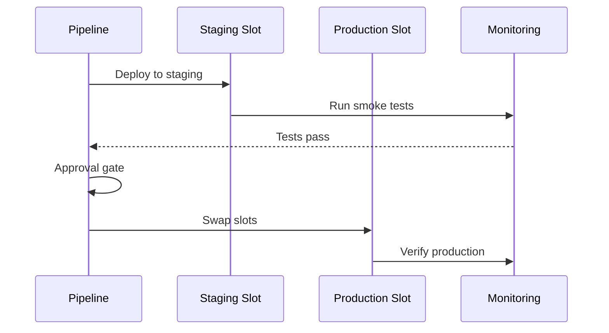

# CI/CD Pipelines

## Overview

This document defines the Continuous Integration and Continuous Deployment (CI/CD) pipelines for the Kafka integration platform using Azure DevOps and GitHub Actions.

## Pipeline Strategy

```mermaid
graph LR
    Dev[Developer] -->|Push| Git[Git Repository]
    Git -->|Trigger| CI[CI Pipeline]
    CI -->|Build| Artifacts[Build Artifacts]
    Artifacts -->|Deploy| Dev_Env[Dev Environment]
    Dev_Env -->|Promote| Test_Env[Test Environment]
    Test_Env -->|Promote| Stg_Env[Staging Environment]
    Stg_Env -->|Approve| Prod_Env[Production Environment]

    style CI fill:#FFD700
    style Prod_Env fill:#90EE90
```



## Repository Structure

```
.
├── src/
│   ├── Producers/
│   │   ├── Inventory.Producer/
│   │   ├── Orders.Producer/
│   │   └── ...
│   └── Consumers/
│       ├── Inventory.Consumer/
│       ├── Orders.Consumer/
│       └── ...
├── infrastructure/
│   ├── bicep/
│   │   ├── main.bicep
│   │   └── modules/
│   └── parameters/
│       ├── dev.parameters.json
│       ├── test.parameters.json
│       ├── stg.parameters.json
│       └── prod.parameters.json
├── tests/
│   ├── Unit.Tests/
│   └── Integration.Tests/
├── .github/
│   └── workflows/
│       ├── ci-producers.yml
│       ├── ci-consumers.yml
│       └── cd-infrastructure.yml
├── azure-pipelines/
│   ├── ci-pipeline.yml
│   └── cd-pipeline.yml
└── README.md
```

## CI Pipeline (Build and Test)

### GitHub Actions - CI Workflow

```yaml
# .github/workflows/ci-producers.yml
name: CI - Producers

on:
  push:
    branches: [main, develop]
    paths:
      - "src/Producers/**"
      - "tests/**"
  pull_request:
    branches: [main, develop]

env:
  DOTNET_VERSION: "8.0.x"

jobs:
  build-and-test:
    runs-on: ubuntu-latest

    steps:
      - name: Checkout code
        uses: actions/checkout@v4

      - name: Setup .NET
        uses: actions/setup-dotnet@v4
        with:
          dotnet-version: ${{ env.DOTNET_VERSION }}

      - name: Restore dependencies
        run: dotnet restore src/Producers/Producers.sln

      - name: Build
        run: dotnet build src/Producers/Producers.sln --configuration Release --no-restore

      - name: Run unit tests
        run: dotnet test tests/Unit.Tests/Unit.Tests.csproj --configuration Release --no-build --verbosity normal --logger "trx" --collect:"XPlat Code Coverage"

      - name: Publish test results
        uses: dorny/test-reporter@v1
        if: always()
        with:
          name: Unit Test Results
          path: "**/TestResults/*.trx"
          reporter: dotnet-trx

      - name: Upload code coverage
        uses: codecov/codecov-action@v3
        with:
          files: "**/coverage.cobertura.xml"
          flags: unittests
          name: codecov-umbrella

      - name: Publish Function Apps
        run: |
          dotnet publish src/Producers/Inventory.Producer/Inventory.Producer.csproj --configuration Release --output ./publish/inventory-producer
          dotnet publish src/Producers/Orders.Producer/Orders.Producer.csproj --configuration Release --output ./publish/orders-producer

      - name: Upload artifacts
        uses: actions/upload-artifact@v4
        with:
          name: function-apps
          path: ./publish/
          retention-days: 7
```

### Azure DevOps - CI Pipeline

```yaml
# azure-pipelines/ci-pipeline.yml
trigger:
  branches:
    include:
      - main
      - develop
  paths:
    include:
      - src/**
      - tests/**

pool:
  vmImage: "ubuntu-latest"

variables:
  buildConfiguration: "Release"
  dotnetVersion: "8.0.x"

stages:
  - stage: Build
    displayName: "Build Stage"
    jobs:
      - job: BuildProducers
        displayName: "Build Producer Function Apps"
        steps:
          - task: UseDotNet@2
            displayName: "Install .NET SDK"
            inputs:
              version: $(dotnetVersion)

          - task: DotNetCoreCLI@2
            displayName: "Restore NuGet packages"
            inputs:
              command: "restore"
              projects: "src/Producers/**/*.csproj"

          - task: DotNetCoreCLI@2
            displayName: "Build projects"
            inputs:
              command: "build"
              projects: "src/Producers/**/*.csproj"
              arguments: "--configuration $(buildConfiguration) --no-restore"

          - task: DotNetCoreCLI@2
            displayName: "Run unit tests"
            inputs:
              command: "test"
              projects: "tests/Unit.Tests/**/*.csproj"
              arguments: '--configuration $(buildConfiguration) --collect:"XPlat Code Coverage" --logger trx'

          - task: PublishTestResults@2
            displayName: "Publish test results"
            inputs:
              testResultsFormat: "VSTest"
              testResultsFiles: "**/*.trx"
              mergeTestResults: true

          - task: PublishCodeCoverageResults@2
            displayName: "Publish code coverage"
            inputs:
              summaryFileLocation: "$(Agent.TempDirectory)/**/*cobertura.xml"

          - task: DotNetCoreCLI@2
            displayName: "Publish Inventory Producer"
            inputs:
              command: "publish"
              projects: "src/Producers/Inventory.Producer/Inventory.Producer.csproj"
              arguments: "--configuration $(buildConfiguration) --output $(Build.ArtifactStagingDirectory)/inventory-producer"
              zipAfterPublish: true

          - task: DotNetCoreCLI@2
            displayName: "Publish Orders Producer"
            inputs:
              command: "publish"
              projects: "src/Producers/Orders.Producer/Orders.Producer.csproj"
              arguments: "--configuration $(buildConfiguration) --output $(Build.ArtifactStagingDirectory)/orders-producer"
              zipAfterPublish: true

          - task: PublishBuildArtifacts@1
            displayName: "Publish artifacts"
            inputs:
              pathToPublish: "$(Build.ArtifactStagingDirectory)"
              artifactName: "function-apps"
```

## CD Pipeline (Deploy)

### GitHub Actions - CD Workflow

```yaml
# .github/workflows/cd-production.yml
name: CD - Production

on:
  workflow_dispatch:
    inputs:
      environment:
        description: "Environment to deploy to"
        required: true
        default: "production"
        type: choice
        options:
          - dev
          - test
          - staging
          - production

env:
  AZURE_SUBSCRIPTION_ID: ${{ secrets.AZURE_SUBSCRIPTION_ID }}
  AZURE_CREDENTIALS: ${{ secrets.AZURE_CREDENTIALS }}

jobs:
  deploy-infrastructure:
    runs-on: ubuntu-latest
    environment: ${{ github.event.inputs.environment }}

    steps:
      - name: Checkout code
        uses: actions/checkout@v4

      - name: Azure Login
        uses: azure/login@v1
        with:
          creds: ${{ secrets.AZURE_CREDENTIALS }}

      - name: Deploy Bicep
        uses: azure/arm-deploy@v1
        with:
          subscriptionId: ${{ env.AZURE_SUBSCRIPTION_ID }}
          scope: subscription
          region: eastus
          template: ./infrastructure/bicep/main.bicep
          parameters: ./infrastructure/parameters/${{ github.event.inputs.environment }}.parameters.json
          deploymentName: kafka-integration-${{ github.run_number }}

  deploy-function-apps:
    runs-on: ubuntu-latest
    needs: deploy-infrastructure
    environment: ${{ github.event.inputs.environment }}

    strategy:
      matrix:
        functionApp:
          - name: inventory-producer
            appName: func-${{ github.event.inputs.environment }}-eastus-inventory-producer
          - name: orders-producer
            appName: func-${{ github.event.inputs.environment }}-eastus-orders-producer
          - name: inventory-consumer
            appName: func-${{ github.event.inputs.environment }}-eastus-inventory-consumer
          - name: orders-consumer
            appName: func-${{ github.event.inputs.environment }}-eastus-orders-consumer

    steps:
      - name: Download artifact
        uses: actions/download-artifact@v4
        with:
          name: function-apps
          path: ./publish

      - name: Azure Login
        uses: azure/login@v1
        with:
          creds: ${{ secrets.AZURE_CREDENTIALS }}

      - name: Deploy to Azure Functions
        uses: Azure/functions-action@v1
        with:
          app-name: ${{ matrix.functionApp.appName }}
          package: ./publish/${{ matrix.functionApp.name }}

      - name: Verify deployment
        run: |
          response=$(curl -s -o /dev/null -w "%{http_code}" https://${{ matrix.functionApp.appName }}.azurewebsites.net/api/health)
          if [ $response -ne 200 ]; then
            echo "Health check failed with status $response"
            exit 1
          fi
```

### Azure DevOps - CD Pipeline

```yaml
# azure-pipelines/cd-pipeline.yml
trigger: none # Manual or triggered by CI

resources:
  pipelines:
    - pipeline: build
      source: "CI Pipeline"
      trigger:
        branches:
          - main

variables:
  - group: kafka-integration-prod # Variable group with secrets

stages:
  - stage: DeployInfrastructure
    displayName: "Deploy Infrastructure"
    jobs:
      - deployment: DeployBicep
        displayName: "Deploy Bicep Templates"
        environment: "production"
        strategy:
          runOnce:
            deploy:
              steps:
                - task: AzureCLI@2
                  displayName: "Deploy Bicep"
                  inputs:
                    azureSubscription: "Azure Production"
                    scriptType: "bash"
                    scriptLocation: "inlineScript"
                    inlineScript: |
                      az deployment sub create \
                        --name kafka-integration-$(Build.BuildId) \
                        --location eastus \
                        --template-file infrastructure/bicep/main.bicep \
                        --parameters infrastructure/parameters/prod.parameters.json

  - stage: DeployProducers
    displayName: "Deploy Producers"
    dependsOn: DeployInfrastructure
    jobs:
      - deployment: DeployInventoryProducer
        displayName: "Deploy Inventory Producer"
        environment: "production"
        strategy:
          runOnce:
            deploy:
              steps:
                - download: build
                  artifact: function-apps

                - task: AzureFunctionApp@2
                  displayName: "Deploy Function App"
                  inputs:
                    azureSubscription: "Azure Production"
                    appType: "functionApp"
                    appName: "func-prod-eastus-inventory-producer"
                    package: "$(Pipeline.Workspace)/build/function-apps/inventory-producer.zip"
                    deploymentMethod: "auto"

  - stage: DeployConsumers
    displayName: "Deploy Consumers"
    dependsOn: DeployProducers
    jobs:
      - deployment: DeployInventoryConsumer
        displayName: "Deploy Inventory Consumer"
        environment: "production"
        strategy:
          runOnce:
            deploy:
              steps:
                - download: build
                  artifact: function-apps

                - task: AzureFunctionApp@2
                  displayName: "Deploy Function App"
                  inputs:
                    azureSubscription: "Azure Production"
                    appType: "functionApp"
                    appName: "func-prod-eastus-inventory-consumer"
                    package: "$(Pipeline.Workspace)/build/function-apps/inventory-consumer.zip"
                    deploymentMethod: "auto"

                - task: AzureCLI@2
                  displayName: "Restart Function App"
                  inputs:
                    azureSubscription: "Azure Production"
                    scriptType: "bash"
                    scriptLocation: "inlineScript"
                    inlineScript: |
                      az functionapp restart \
                        --name func-prod-eastus-inventory-consumer \
                        --resource-group rg-prod-eastus-integration

  - stage: SmokeTests
    displayName: "Smoke Tests"
    dependsOn: DeployConsumers
    jobs:
      - job: RunSmokeTests
        displayName: "Run Smoke Tests"
        steps:
          - task: DotNetCoreCLI@2
            displayName: "Run smoke tests"
            inputs:
              command: "test"
              projects: "tests/Smoke.Tests/**/*.csproj"
              arguments: "--configuration Release --filter Category=Smoke"
```

## Deployment Slots Strategy

### Staging Slot Deployment



### Slot Configuration

```yaml
- task: AzureAppServiceManage@0
  displayName: "Swap deployment slots"
  inputs:
    azureSubscription: "Azure Production"
    action: "Swap Slots"
    webAppName: "func-prod-eastus-inventory-consumer"
    resourceGroupName: "rg-prod-eastus-integration"
    sourceSlot: "staging"
    targetSlot: "production"
    preserveVnet: true
```

## Environment Variables and Secrets

### Azure DevOps Variable Groups

```yaml
# Variable group: kafka-integration-prod
variables:
  - name: KafkaBootstrapServers
    value: evhns-prod-eastus-kafka.servicebus.windows.net:9093

  - name: TableStorageAccountName
    value: stprodeastustablestorage

  - name: KeyVaultName
    value: kv-prod-eastus-integration

  # Secrets (from Azure Key Vault)
  - group: kafka-secrets-prod
```

### GitHub Secrets

```yaml
# Stored in GitHub Secrets:
# - AZURE_CREDENTIALS (Service Principal JSON)
# - AZURE_SUBSCRIPTION_ID
# - KAFKA_CONNECTION_STRING
# - STORAGE_CONNECTION_STRING

env:
  KAFKA_CONNECTION_STRING: ${{ secrets.KAFKA_CONNECTION_STRING }}
  STORAGE_CONNECTION_STRING: ${{ secrets.STORAGE_CONNECTION_STRING }}
```

## Integration Tests in Pipeline

### Run Integration Tests

```yaml
- job: IntegrationTests
  displayName: "Run Integration Tests"
  dependsOn: DeployToTest
  pool:
    vmImage: "ubuntu-latest"

  steps:
    - task: UseDotNet@2
      inputs:
        version: "8.0.x"

    - task: AzureCLI@2
      displayName: "Get test environment connection strings"
      inputs:
        azureSubscription: "Azure Test"
        scriptType: "bash"
        scriptLocation: "inlineScript"
        inlineScript: |
          export KAFKA_CS=$(az eventhubs namespace authorization-rule keys list \
            --resource-group rg-test-eastus-integration \
            --namespace-name evhns-test-eastus-kafka \
            --name RootManageSharedAccessKey \
            --query primaryConnectionString -o tsv)

          export STORAGE_CS=$(az storage account show-connection-string \
            --name sttesteastustablestorage \
            --resource-group rg-test-eastus-integration \
            --query connectionString -o tsv)

          echo "##vso[task.setvariable variable=KAFKA_CONNECTION_STRING;issecret=true]$KAFKA_CS"
          echo "##vso[task.setvariable variable=STORAGE_CONNECTION_STRING;issecret=true]$STORAGE_CS"

    - task: DotNetCoreCLI@2
      displayName: "Run integration tests"
      inputs:
        command: "test"
        projects: "tests/Integration.Tests/**/*.csproj"
        arguments: "--configuration Release --filter Category=Integration"
      env:
        KAFKA_CONNECTION_STRING: $(KAFKA_CONNECTION_STRING)
        STORAGE_CONNECTION_STRING: $(STORAGE_CONNECTION_STRING)
```

## Rollback Strategy

### Automated Rollback on Failure

```yaml
- stage: Production
  jobs:
    - deployment: DeployProduction
      environment: production
      strategy:
        runOnce:
          deploy:
            steps:
              - task: AzureFunctionApp@2
                inputs:
                  appName: func-prod-eastus-inventory-consumer
                  package: $(Pipeline.Workspace)/function-apps/inventory-consumer.zip

          on:
            failure:
              steps:
                - task: AzureAppServiceManage@0
                  displayName: "Rollback - Swap slots back"
                  inputs:
                    azureSubscription: "Azure Production"
                    action: "Swap Slots"
                    webAppName: "func-prod-eastus-inventory-consumer"
                    resourceGroupName: "rg-prod-eastus-integration"
                    sourceSlot: "production"
                    targetSlot: "staging"

                - task: Bash@3
                  displayName: "Notify team of rollback"
                  inputs:
                    targetType: "inline"
                    script: |
                      echo "Deployment failed. Rolled back to previous version."
```

## Infrastructure as Code (IaC) Pipeline

### Bicep Validation and Deployment

```yaml
- stage: ValidateInfrastructure
  displayName: "Validate Bicep Templates"
  jobs:
    - job: ValidateBicep
      steps:
        - task: AzureCLI@2
          displayName: "Bicep linting"
          inputs:
            azureSubscription: "Azure Production"
            scriptType: "bash"
            scriptLocation: "inlineScript"
            inlineScript: |
              az bicep build --file infrastructure/bicep/main.bicep

        - task: AzureCLI@2
          displayName: "What-If deployment"
          inputs:
            azureSubscription: "Azure Production"
            scriptType: "bash"
            scriptLocation: "inlineScript"
            inlineScript: |
              az deployment sub what-if \
                --name kafka-integration-whatif \
                --location eastus \
                --template-file infrastructure/bicep/main.bicep \
                --parameters infrastructure/parameters/prod.parameters.json
```

## Security Scanning

### Dependency Scanning

```yaml
- job: SecurityScan
  displayName: "Security Scanning"
  steps:
    - task: UseDotNet@2
      inputs:
        version: "8.0.x"

    - script: |
        dotnet list package --vulnerable --include-transitive
      displayName: "Check for vulnerable packages"

    - task: dependency-check-build-task@6
      displayName: "OWASP Dependency Check"
      inputs:
        projectName: "Kafka Integration"
        scanPath: "$(Build.SourcesDirectory)"
        format: "HTML"
        failOnCVSS: "7"
```

### Secret Scanning

```yaml
- task: CredScan@3
  displayName: "Credential Scanner"
  inputs:
    toolMajorVersion: "V2"
    suppressionsFile: "$(Build.SourcesDirectory)/credscan-suppressions.json"

- task: PostAnalysis@2
  displayName: "Post Analysis"
  inputs:
    GdnBreakAllTools: true
    GdnBreakGdnToolCredScan: true
```

## Monitoring and Notifications

### Slack/Teams Notifications

```yaml
- task: PublishToAzureServiceBus@1
  condition: always()
  displayName: "Notify deployment status"
  inputs:
    azureSubscription: "Azure Production"
    messageBody: |
      {
        "buildId": "$(Build.BuildId)",
        "buildNumber": "$(Build.BuildNumber)",
        "status": "$(Agent.JobStatus)",
        "environment": "production",
        "timestamp": "$(Build.FinishTime)"
      }
    serviceBusQueueName: "deployment-notifications"
```

### Application Insights Integration

```yaml
- task: AzureCLI@2
  displayName: "Create deployment annotation"
  inputs:
    azureSubscription: "Azure Production"
    scriptType: "bash"
    scriptLocation: "inlineScript"
    inlineScript: |
      az rest --method put \
        --url "https://api.applicationinsights.io/v1/apps/$(AppInsightsId)/Annotations" \
        --headers "X-API-Key=$(AppInsightsApiKey)" \
        --body '{
          "AnnotationName": "Deployment",
          "EventTime": "'$(date -u +%Y-%m-%dT%H:%M:%SZ)'",
          "Category": "Deployment",
          "Properties": {
            "BuildNumber": "$(Build.BuildNumber)",
            "ReleaseId": "$(Release.ReleaseId)"
          }
        }'
```

## Best Practices Summary

| Practice                   | Description                                        |
| -------------------------- | -------------------------------------------------- |
| **Automated Testing**      | Run unit, integration, and smoke tests in pipeline |
| **Staged Deployments**     | Dev → Test → Staging → Production                  |
| **Approval Gates**         | Manual approval before production                  |
| **Deployment Slots**       | Blue-green deployments for zero downtime           |
| **Automated Rollback**     | Auto-rollback on health check failure              |
| **IaC Validation**         | Lint and what-if before deploying Bicep            |
| **Security Scanning**      | Scan for vulnerabilities and secrets               |
| **Monitoring Integration** | Create deployment annotations in App Insights      |
| **Notifications**          | Alert team on deployment status                    |
| **Versioning**             | Semantic versioning for releases                   |
