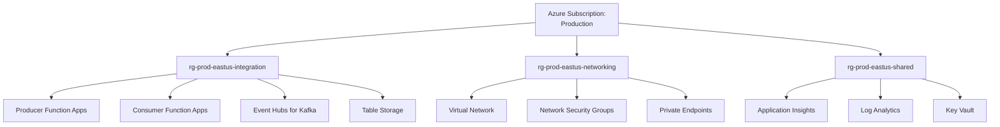
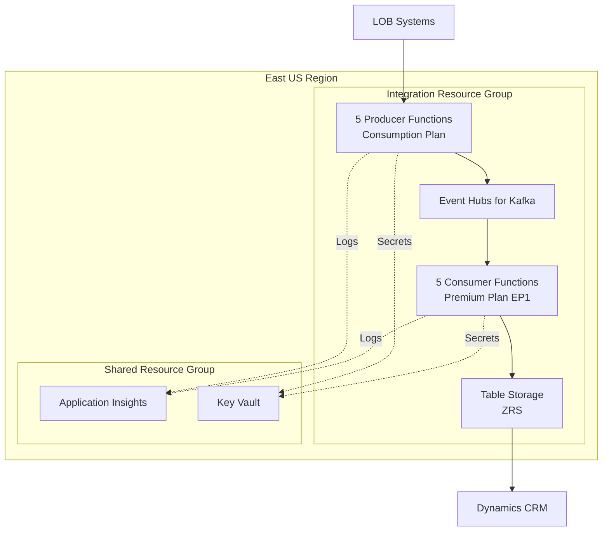
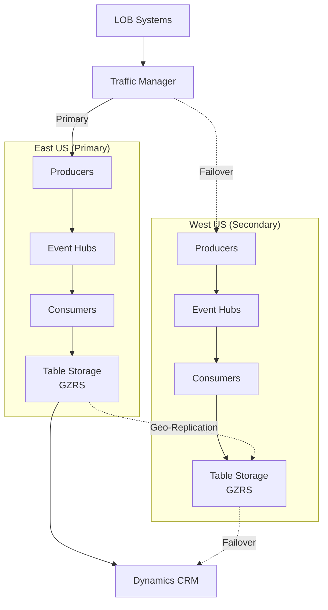
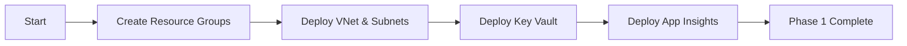
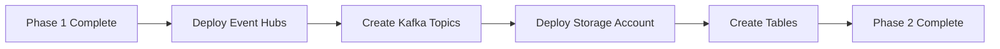
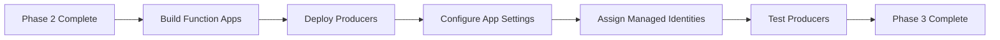
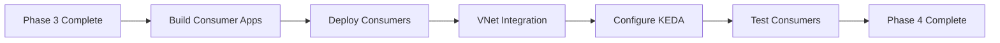
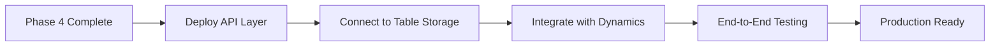

# Deployment Architecture

## Overview

This document defines the Azure resource organization, naming conventions, and deployment topology for the Kafka integration platform.

## Resource Group Organization



### Resource Group Strategy

| Resource Group               | Purpose                    | Lifecycle   | Resources                                      |
| ---------------------------- | -------------------------- | ----------- | ---------------------------------------------- |
| `rg-prod-eastus-integration` | Core integration resources | Application | Function Apps, Event Hubs, Storage             |
| `rg-prod-eastus-networking`  | Network infrastructure     | Long-lived  | VNet, Subnets, NSGs, Private Endpoints         |
| `rg-prod-eastus-shared`      | Shared services            | Long-lived  | Key Vault, Application Insights, Log Analytics |

**Benefits:**

- Independent lifecycle management
- Clear separation of concerns
- Different RBAC policies per group
- Easier cost tracking

## Naming Conventions

### Format

```
{resource-type}-{environment}-{region}-{purpose}-{instance}
```

### Examples

| Resource Type       | Example                               | Pattern                              |
| ------------------- | ------------------------------------- | ------------------------------------ |
| Function App        | `func-prod-eastus-inventory-producer` | func-{env}-{region}-{domain}-{role}  |
| Storage Account     | `stprodeastusintegration`             | st{env}{region}{purpose} (no dashes) |
| Event Hub Namespace | `evhns-prod-eastus-kafka`             | evhns-{env}-{region}-{purpose}       |
| Event Hub           | `inventory.item.updated`              | {domain}.{entity}.{action}           |
| Key Vault           | `kv-prod-eastus-integration`          | kv-{env}-{region}-{purpose}          |
| App Insights        | `appi-prod-eastus-integration`        | appi-{env}-{region}-{purpose}        |
| Log Analytics       | `log-prod-eastus-integration`         | log-{env}-{region}-{purpose}         |
| VNet                | `vnet-prod-eastus`                    | vnet-{env}-{region}                  |
| Subnet              | `snet-prod-eastus-functions`          | snet-{env}-{region}-{purpose}        |

### Environment Abbreviations

- `dev` - Development
- `test` - Testing
- `stg` - Staging
- `prod` - Production

### Region Abbreviations

- `eastus` - East US
- `westus` - West US
- `northeurope` - North Europe
- `westeurope` - West Europe

## Regional Deployment Topology

### Single Region (Initial Deployment)



### Multi-Region (High Availability)



## Complete Resource Inventory

### Production Environment (East US)

#### Function Apps (Producers - Consumption Plan)

| Name                                  | Runtime         | Plan        | Managed Identity |
| ------------------------------------- | --------------- | ----------- | ---------------- |
| `func-prod-eastus-inventory-producer` | .NET 8 Isolated | Consumption | System-assigned  |
| `func-prod-eastus-orders-producer`    | .NET 8 Isolated | Consumption | System-assigned  |
| `func-prod-eastus-customers-producer` | .NET 8 Isolated | Consumption | System-assigned  |
| `func-prod-eastus-products-producer`  | .NET 8 Isolated | Consumption | System-assigned  |
| `func-prod-eastus-pricing-producer`   | .NET 8 Isolated | Consumption | System-assigned  |

#### Function Apps (Consumers - Premium Plan)

| Name                                  | Runtime         | Plan        | Min Instances | Max Instances |
| ------------------------------------- | --------------- | ----------- | ------------- | ------------- |
| `func-prod-eastus-inventory-consumer` | .NET 8 Isolated | Premium EP1 | 2             | 20            |
| `func-prod-eastus-orders-consumer`    | .NET 8 Isolated | Premium EP1 | 2             | 20            |
| `func-prod-eastus-customers-consumer` | .NET 8 Isolated | Premium EP1 | 2             | 20            |
| `func-prod-eastus-products-consumer`  | .NET 8 Isolated | Premium EP1 | 2             | 20            |
| `func-prod-eastus-pricing-consumer`   | .NET 8 Isolated | Premium EP1 | 2             | 20            |

#### Event Hubs for Kafka

| Resource                  | SKU      | Throughput Units | Auto-Inflate | Kafka Enabled |
| ------------------------- | -------- | ---------------- | ------------ | ------------- |
| `evhns-prod-eastus-kafka` | Standard | 2                | Yes (max 20) | Yes           |

**Event Hubs (Topics):**

- 27 event hubs (see [Kafka Topic Map](../schemas/kafka-topic-map.md))
- Partitions: 6-24 per hub
- Retention: 7-90 days

#### Storage Accounts

| Name                       | SKU          | Replication | Purpose                       |
| -------------------------- | ------------ | ----------- | ----------------------------- |
| `stprodeastusintegration`  | Standard_LRS | LRS         | Function Apps runtime storage |
| `stprodeastustablestorage` | Standard_ZRS | ZRS         | Table Storage (business data) |

**Tables:**

- `InventoryItems`
- `InventoryTransfers`
- `Orders`
- `OrderLineItems`
- `OrderPayments`
- `Shipments`
- `Customers`
- `CustomerAddresses`
- `Products`
- `Prices`

#### Shared Resources

| Name                           | Type                    | Purpose                |
| ------------------------------ | ----------------------- | ---------------------- |
| `kv-prod-eastus-integration`   | Key Vault               | Secrets management     |
| `appi-prod-eastus-integration` | Application Insights    | Monitoring and logging |
| `log-prod-eastus-integration`  | Log Analytics Workspace | Log aggregation        |

#### Networking Resources

| Name                           | Type                   | Address Space / Details          |
| ------------------------------ | ---------------------- | -------------------------------- |
| `vnet-prod-eastus`             | Virtual Network        | 10.0.0.0/16                      |
| `snet-prod-eastus-functions`   | Subnet                 | 10.0.1.0/24 (Integration subnet) |
| `snet-prod-eastus-privatelink` | Subnet                 | 10.0.2.0/24 (Private endpoints)  |
| `nsg-prod-eastus-functions`    | Network Security Group | Attached to functions subnet     |

## Deployment Sequence

### Phase 1: Shared Resources



1. Create resource groups
2. Deploy virtual network and subnets
3. Deploy Key Vault with RBAC
4. Deploy Application Insights and Log Analytics
5. Populate Key Vault with initial secrets

### Phase 2: Data Platform



1. Deploy Event Hubs namespace
2. Create all Kafka topics (event hubs)
3. Deploy Table Storage account
4. Create all tables
5. Configure private endpoints

### Phase 3: Producers



1. Build producer Function App code
2. Deploy 5 producer Function Apps
3. Configure application settings (connection strings from Key Vault)
4. Assign managed identities and RBAC roles
5. Test event publishing

### Phase 4: Consumers



1. Build consumer Function App code
2. Deploy 5 consumer Function Apps (Premium plan)
3. Enable VNet integration
4. Configure KEDA scaling
5. Test Kafka consumption and Table Storage writes

### Phase 5: CRM Integration



1. Deploy API layer for CRM integration
2. Test Table Storage queries
3. Integrate with Dynamics CRM
4. Perform end-to-end testing
5. Production cutover

## Infrastructure as Code (Bicep)

### Main Template Structure

```
infrastructure/
├── main.bicep                    # Main orchestration
├── modules/
│   ├── resourceGroups.bicep      # Resource group creation
│   ├── networking.bicep          # VNet, subnets, NSGs
│   ├── keyVault.bicep            # Key Vault
│   ├── appInsights.bicep         # Application Insights
│   ├── eventHubs.bicep           # Event Hubs for Kafka
│   ├── storage.bicep             # Storage accounts
│   ├── functionApps.bicep        # Function Apps
│   └── privateEndpoints.bicep    # Private endpoints
└── parameters/
    ├── dev.parameters.json
    ├── test.parameters.json
    ├── stg.parameters.json
    └── prod.parameters.json
```

### Sample Bicep Module (Function App)

```bicep
param functionAppName string
param location string
param appServicePlanId string
param storageAccountConnectionString string
param appInsightsInstrumentationKey string
param keyVaultName string

resource functionApp 'Microsoft.Web/sites@2023-01-01' = {
  name: functionAppName
  location: location
  kind: 'functionapp'
  identity: {
    type: 'SystemAssigned'
  }
  properties: {
    serverFarmId: appServicePlanId
    siteConfig: {
      appSettings: [
        {
          name: 'AzureWebJobsStorage'
          value: storageAccountConnectionString
        }
        {
          name: 'FUNCTIONS_EXTENSION_VERSION'
          value: '~4'
        }
        {
          name: 'FUNCTIONS_WORKER_RUNTIME'
          value: 'dotnet-isolated'
        }
        {
          name: 'APPINSIGHTS_INSTRUMENTATIONKEY'
          value: appInsightsInstrumentationKey
        }
        {
          name: 'KafkaConnectionString'
          value: '@Microsoft.KeyVault(SecretUri=https://${keyVaultName}.vault.azure.net/secrets/KafkaConnectionString/)'
        }
        {
          name: 'TableStorageConnection'
          value: '@Microsoft.KeyVault(SecretUri=https://${keyVaultName}.vault.azure.net/secrets/TableStorageConnection/)'
        }
      ]
    }
  }
}

output functionAppId string = functionApp.id
output functionAppPrincipalId string = functionApp.identity.principalId
```

## Deployment Commands

### Azure CLI Deployment

```bash
# Login to Azure
az login

# Set subscription
az account set --subscription "Production"

# Deploy to production
az deployment sub create \
  --name kafka-integration-deployment \
  --location eastus \
  --template-file infrastructure/main.bicep \
  --parameters infrastructure/parameters/prod.parameters.json

# Verify deployment
az deployment sub show \
  --name kafka-integration-deployment \
  --query properties.outputs
```

### PowerShell Deployment

```powershell
# Login to Azure
Connect-AzAccount

# Set subscription
Set-AzContext -Subscription "Production"

# Deploy to production
New-AzDeployment `
  -Name kafka-integration-deployment `
  -Location eastus `
  -TemplateFile infrastructure/main.bicep `
  -TemplateParameterFile infrastructure/parameters/prod.parameters.json

# Verify deployment
Get-AzDeployment -Name kafka-integration-deployment | `
  Select-Object -ExpandProperty Outputs
```

## Deployment Validation

### Post-Deployment Checks

```bash
# Verify all resources created
az resource list --resource-group rg-prod-eastus-integration --output table

# Check Function App status
az functionapp list --resource-group rg-prod-eastus-integration --query "[].{Name:name, State:state, Runtime:kind}" --output table

# Verify Event Hubs created
az eventhubs eventhub list --resource-group rg-prod-eastus-integration --namespace-name evhns-prod-eastus-kafka --output table

# Check Table Storage tables
az storage table list --account-name stprodeastustablestorage --output table

# Verify managed identities assigned
az functionapp identity show --name func-prod-eastus-inventory-producer --resource-group rg-prod-eastus-integration
```

## Disaster Recovery

### Backup Strategy

| Resource            | Backup Method                  | Frequency      | Retention  |
| ------------------- | ------------------------------ | -------------- | ---------- |
| Table Storage       | Geo-replication (GZRS)         | Continuous     | N/A        |
| Key Vault           | Soft-delete + purge protection | N/A            | 90 days    |
| Function App Code   | Git repository                 | Per commit     | Indefinite |
| Infrastructure Code | Git repository                 | Per commit     | Indefinite |
| Event Hubs Config   | IaC templates                  | Per deployment | Indefinite |

### Recovery Time Objectives (RTO)

| Scenario               | RTO         | Recovery Procedure               |
| ---------------------- | ----------- | -------------------------------- |
| Function App failure   | < 5 minutes | Auto-restart, redeploy if needed |
| Storage account outage | < 1 hour    | Failover to geo-replica          |
| Event Hubs outage      | < 1 hour    | Failover to secondary region     |
| Complete region outage | < 4 hours   | Deploy to secondary region       |

### Recovery Point Objectives (RPO)

| Data Type          | RPO          | Notes                                        |
| ------------------ | ------------ | -------------------------------------------- |
| Table Storage data | < 15 minutes | GZRS replication lag                         |
| Kafka events       | 0 (replay)   | Events can be replayed from retention period |
| Configuration      | 0            | Stored in Git                                |

## Cost Management

### Monthly Cost Breakdown (Estimated)

| Resource                             | Quantity        | Unit Cost     | Monthly Cost      |
| ------------------------------------ | --------------- | ------------- | ----------------- |
| Producer Function Apps (Consumption) | 5               | ~$0           | $0                |
| Consumer Function Apps (Premium EP1) | 5 × 2 instances | $150/instance | $1,500            |
| Event Hubs Standard                  | 2 TU            | $35/TU        | $70               |
| Table Storage (ZRS)                  | 100 GB          | $0.175/GB     | $18               |
| Application Insights                 | 50 GB/month     | $2.30/GB      | $115              |
| Key Vault                            | Transactions    | Minimal       | $5                |
| VNet & Private Endpoints             | 10 endpoints    | $10/endpoint  | $100              |
| **Total**                            |                 |               | **~$1,808/month** |

### Cost Optimization Tips

1. **Use Consumption for Producers** - Save ~$1,500/month vs Premium
2. **Right-size Premium SKUs** - Start with EP1, upgrade only if needed
3. **Enable Event Hubs Auto-Inflate** - Pay for what you use
4. **Configure Application Insights Sampling** - Reduce ingestion costs
5. **Use Retention Policies** - Archive old Table Storage data

## Monitoring and Alerting

### Key Metrics to Monitor

- Function App execution success rate
- Kafka consumer lag
- Table Storage throttling (503 errors)
- Application Insights availability
- Key Vault access failures

### Recommended Alerts

```kusto
// High consumer lag
customMetrics
| where name == "KafkaConsumerLag"
| where value > 1000
| summarize avg(value) by bin(timestamp, 5m)

// Function execution failures
requests
| where success == false
| where cloud_RoleName contains "func-prod"
| summarize ErrorCount = count() by bin(timestamp, 5m), cloud_RoleName
| where ErrorCount > 10

// Table Storage throttling
dependencies
| where target contains "table.core.windows.net"
| where resultCode == "503"
| summarize ThrottleCount = count() by bin(timestamp, 5m)
```

## Next Steps

After deployment:

1. Review [Security Design](security-design.md) for RBAC and network security
2. Set up [CI/CD Pipelines](cicd-pipelines.md) for automated deployments
3. Configure [Monitoring and Alerting](monitoring-alerting.md) dashboards
4. Plan [Disaster Recovery](../operations/disaster-recovery.md) drills
