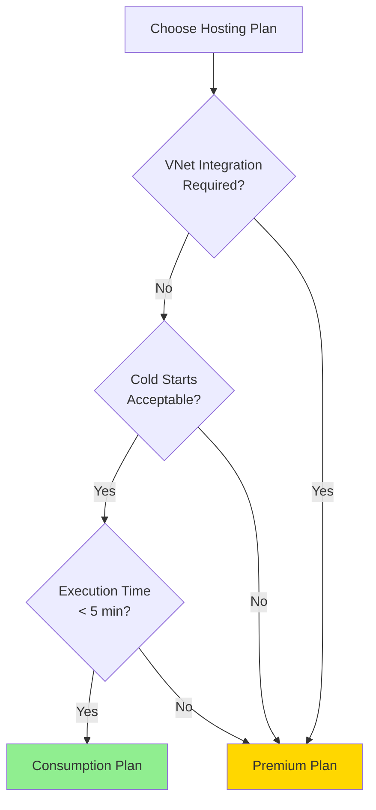
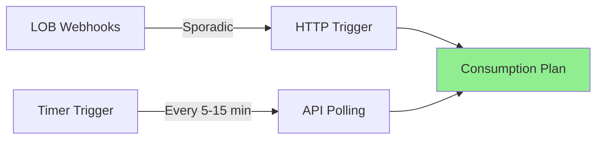
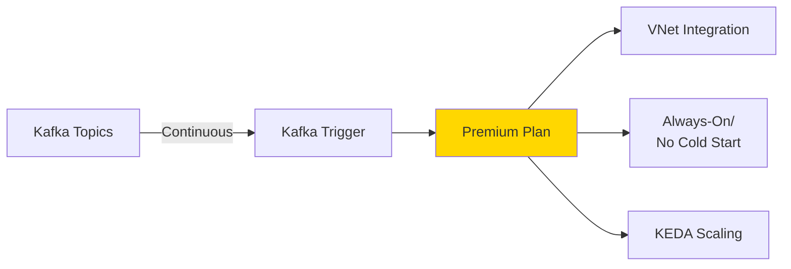
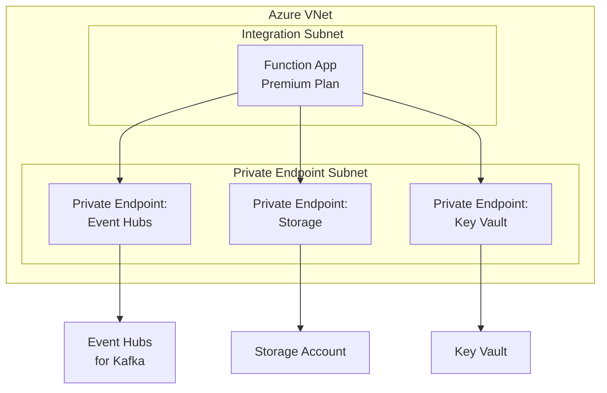

# Function App Hosting Plans

## Overview

Azure Functions can run on different hosting plans. This document compares options and provides recommendations for producer and consumer Function Apps.

## Hosting Plan Comparison

| Feature              | Consumption        | Premium            | Dedicated (App Service) |
| -------------------- | ------------------ | ------------------ | ----------------------- |
| **Pricing**          | Pay per execution  | Fixed + execution  | Fixed monthly           |
| **Scaling**          | Automatic (0-200)  | Automatic (1-100)  | Manual/auto (1-N)       |
| **Cold Start**       | Yes (5-10 sec)     | No (pre-warmed)    | No                      |
| **Timeout**          | 5 min (10 min max) | 30 min (unlimited) | 30 min (unlimited)      |
| **VNet Integration** | No                 | Yes                | Yes                     |
| **Deployment Slots** | No                 | Yes                | Yes                     |
| **Max Instances**    | 200                | 100                | Depends on plan         |
| **Storage**          | Shared             | Dedicated          | Dedicated               |

## Hosting Plan Decision Tree



## Recommended Plans by Function Type

### Producers (HTTP/Timer Triggers)

**Recommended: Consumption Plan**



**Rationale:**

- Infrequent execution (webhooks, timers)
- Cold starts acceptable (not user-facing)
- Cost-effective for low/variable volume
- Automatic scaling for burst traffic

**Configuration:**

```json
{
  "sku": {
    "name": "Y1",
    "tier": "Dynamic"
  },
  "kind": "functionapp",
  "properties": {
    "reserved": false
  }
}
```

### Consumers (Kafka Triggers)

**Recommended: Premium Plan (EP1 or EP2)**



**Rationale:**

- Continuous processing (always polling Kafka)
- No cold starts needed (always-on instances)
- VNet integration for secure Kafka access
- KEDA-based scaling on consumer lag
- Predictable, consistent performance

**Configuration:**

```json
{
  "sku": {
    "name": "EP1",
    "tier": "ElasticPremium"
  },
  "kind": "functionapp",
  "properties": {
    "reserved": true,
    "maximumElasticWorkerCount": 20,
    "minimumElasticWorkerCount": 2
  }
}
```

## Premium Plan SKUs

| SKU | vCPU | RAM    | Storage | Est. Monthly Cost |
| --- | ---- | ------ | ------- | ----------------- |
| EP1 | 1    | 3.5 GB | 250 GB  | ~$150/instance    |
| EP2 | 2    | 7 GB   | 250 GB  | ~$300/instance    |
| EP3 | 4    | 14 GB  | 250 GB  | ~$600/instance    |

**Recommendation for Consumers:** Start with EP1, scale to EP2 if needed

## Scaling Configuration

### Consumption Plan (Producers)

```json
{
  "functionAppScaleLimit": 10,
  "routingRules": [],
  "scaleSettings": {
    "minimumInstanceCount": 0,
    "maximumInstanceCount": 10
  }
}
```

**Scaling Triggers:**

- HTTP: Based on request queue depth
- Timer: One instance per schedule
- Event Grid: Based on event rate

### Premium Plan (Consumers)

```json
{
  "properties": {
    "minimumElasticWorkerCount": 2,
    "maximumElasticWorkerCount": 20
  }
}
```

**KEDA Scaling (Kafka Trigger):**

```yaml
triggers:
  - type: kafka
    metadata:
      topic: inventory.item.updated
      bootstrapServers: kafka:9092
      consumerGroup: inventory-writer
      lagThreshold: "100" # Scale out if lag > 100 messages
      offsetResetPolicy: latest
      allowIdleConsumers: false
```

**Scaling Behavior:**

- Min instances: 2 (always-on for low latency)
- Max instances: 20 (one per partition + buffer)
- Scale out when: Consumer lag > 100 messages per instance
- Scale in when: Lag < 50 messages for 5 minutes

## VNet Integration Architecture

### Premium Plan with Private Endpoints



**Benefits:**

- All traffic stays within Azure backbone
- No public internet exposure
- Enhanced security and compliance
- Lower latency

**Requirements:**

- Premium or Dedicated plan
- Dedicated subnet with /27 or larger
- Service endpoints or private endpoints

## Cost Estimation

### Monthly Cost Examples (US East)

**Scenario 1: Producer Function Apps (Consumption)**

```
5 Producer Function Apps
- HTTP triggers: 10,000 executions/month each
- Timer triggers: 8,640 executions/month each (every 5 min)
- Average execution: 200ms
- Average memory: 256 MB

Total executions: 93,200
Total GB-seconds: 5,952
Cost: ~$0 (within free grant)
```

**Scenario 2: Consumer Function Apps (Premium EP1)**

```
5 Consumer Function Apps
- SKU: EP1 ($150/instance/month)
- Min instances per app: 2
- Total instances: 10

Monthly cost: 10 × $150 = $1,500

Additional execution cost: ~$50
Total: ~$1,550/month
```

**Scenario 3: Hybrid Approach (Recommended)**

```
Producers (Consumption): $0
Consumers (Premium EP1): $1,500
Total: ~$1,500/month

Savings vs. all Premium: ~$1,500/month
```

## Best Practices

### 1. Use Consumption for Sporadic Workloads

```
✅ Good: Timer triggers every 15 minutes
✅ Good: Webhook endpoints with low traffic
✅ Good: Event Grid triggers

❌ Bad: Kafka triggers (continuous processing)
❌ Bad: High-frequency timers (every 1 minute)
❌ Bad: Workloads requiring consistent sub-second latency
```

### 2. Use Premium for Always-On Scenarios

```
✅ Good: Kafka triggers
✅ Good: Service Bus triggers with high volume
✅ Good: Functions requiring VNet integration
✅ Good: Functions requiring < 100ms latency

❌ Bad: Infrequent timer triggers
❌ Bad: Low-volume HTTP endpoints
❌ Bad: Functions OK with 5-10s cold start
```

### 3. Right-Size Premium Instances

```csharp
// Monitor these metrics to determine if EP1 → EP2 upgrade needed:
// - CPU > 70% consistently
// - Memory > 80% consistently
// - Processing lag increasing
```

### 4. Configure Appropriate Scale Limits

```json
// Don't set maximumInstanceCount too high
{
  "maximumElasticWorkerCount": 20 // Match Kafka partition count
}

// One instance can handle ~2-3 partitions efficiently
```

### 5. Use Deployment Slots (Premium Only)

```
Production Slot: inventory-writer consumer group
Staging Slot: inventory-writer-staging consumer group

Test in staging before swapping to production
```

## Monitoring and Optimization

### Key Metrics to Track

**Consumption Plan:**

- Execution count
- Execution duration
- Failures
- Cold start frequency

**Premium Plan:**

- Instance count
- CPU percentage
- Memory percentage
- Consumer lag (for Kafka triggers)

### Application Insights Queries

```kusto
// Cold start frequency (Consumption)
requests
| where name contains "Function"
| where duration > 5000  // > 5 seconds = likely cold start
| summarize ColdStarts = count() by bin(timestamp, 1h)

// Instance count over time (Premium)
customMetrics
| where name == "FunctionInstanceCount"
| summarize avg(value), max(value) by bin(timestamp, 5m)

// Consumer lag (Premium with Kafka trigger)
customMetrics
| where name == "KafkaConsumerLag"
| summarize avg(value), max(value) by bin(timestamp, 1m), tostring(customDimensions.Topic)
```

### Optimization Tips

1. **Reduce Cold Starts (Consumption):**
   - Minimize dependencies
   - Use pre-compiled functions
   - Consider upgrading to Premium if excessive

2. **Optimize Scaling (Premium):**
   - Tune `lagThreshold` based on processing capacity
   - Set `minimumElasticWorkerCount` based on baseline load
   - Monitor and adjust `maximumElasticWorkerCount`

3. **Reduce Costs:**
   - Use Consumption where appropriate
   - Right-size Premium SKUs (don't over-provision)
   - Set realistic max instance counts

## Migration Path

### Phase 1: Start with Consumption (Producers)

```
All producer Function Apps on Consumption plan
Low cost, validate functionality
```

### Phase 2: Move Consumers to Premium

```
Consumer Function Apps migrate to Premium EP1
Enable VNet integration
Configure KEDA scaling
```

### Phase 3: Optimize Based on Metrics

```
Review 30 days of metrics
Upgrade Premium SKUs if needed (EP1 → EP2)
Adjust scaling parameters
```

### Phase 4: Consider Dedicated Plan (Optional)

```
If workload is very predictable and high-volume:
Dedicated plan may be more cost-effective
Evaluate Reserved Instances for additional savings
```

## Summary Recommendation

| Function Type | Plan        | SKU | Min Instances | Max Instances |
| ------------- | ----------- | --- | ------------- | ------------- |
| **Producers** | Consumption | Y1  | 0             | 10            |
| **Consumers** | Premium     | EP1 | 2 per app     | 20 per app    |

**Estimated Monthly Cost:** ~$1,500 for 5 consumer apps + minimal for producers
