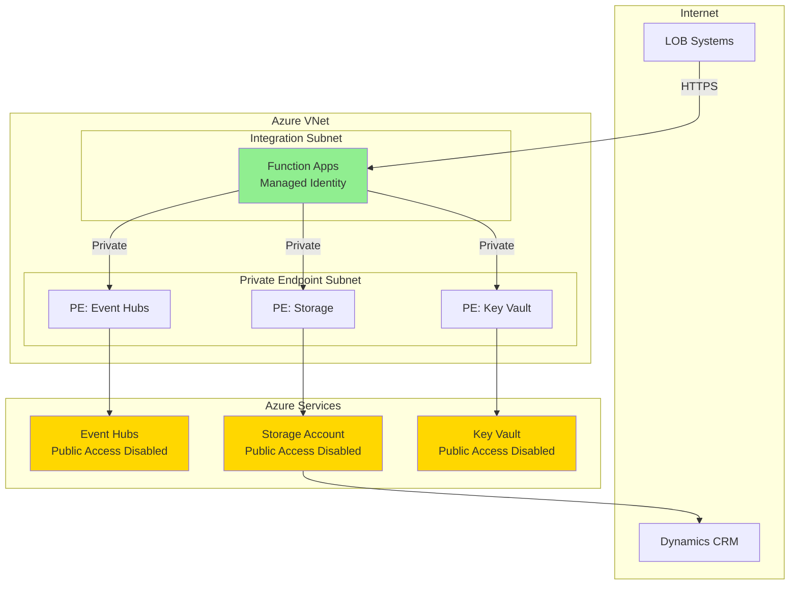
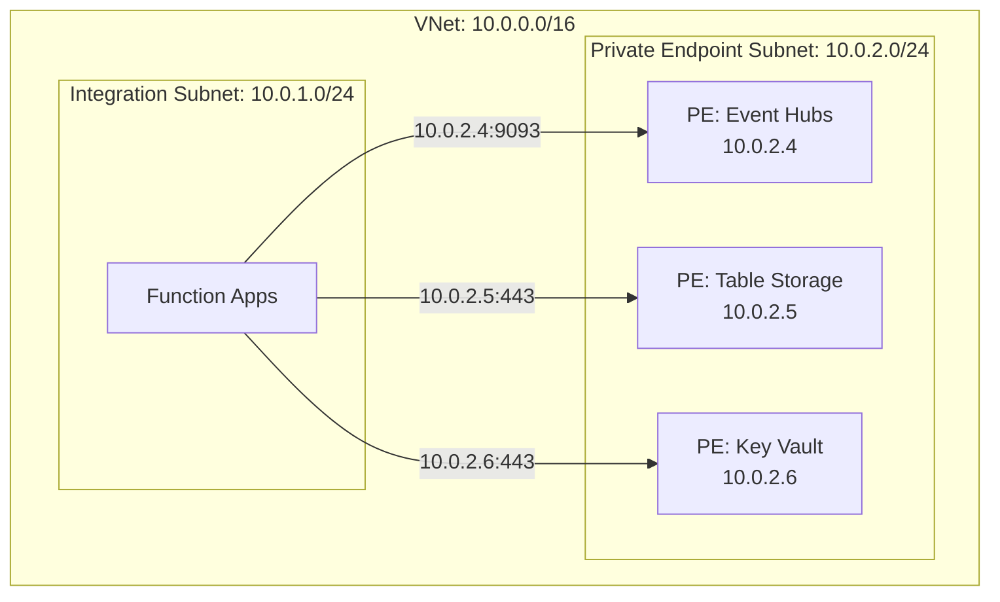
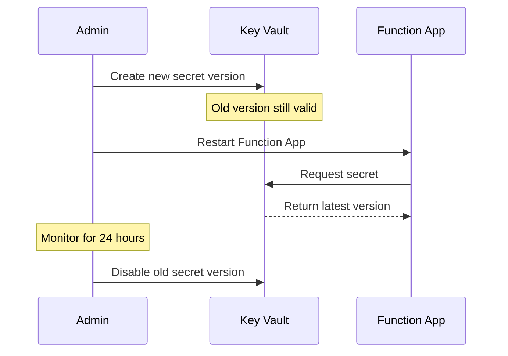
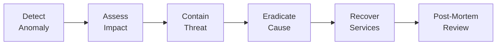

# Security Design

## Overview

This document defines the security architecture, identity management, network security, and compliance controls for the Kafka integration platform.

## Security Architecture



## Identity and Access Management

### Managed Identities

All Function Apps use **System-Assigned Managed Identity** for authentication:

```csharp
// No credentials in code or configuration
var client = new TableClient(
    new Uri("https://stprodeastustablestorage.table.core.windows.net"),
    "InventoryItems",
    new DefaultAzureCredential());
```

**Benefits:**

- No credentials to manage or rotate
- Automatic credential lifecycle
- Azure AD authentication
- Audit trail in Azure AD logs

### RBAC Role Assignments

#### Producer Function Apps

| Resource   | Role                             | Scope                | Justification                       |
| ---------- | -------------------------------- | -------------------- | ----------------------------------- |
| Key Vault  | **Key Vault Secrets User**       | Key Vault            | Read connection strings and secrets |
| Event Hubs | **Azure Event Hubs Data Sender** | Event Hubs namespace | Publish events to Kafka topics      |

```bash
# Assign Event Hubs Data Sender role to inventory producer
az role assignment create \
  --assignee-object-id <producer-managed-identity-principal-id> \
  --role "Azure Event Hubs Data Sender" \
  --scope /subscriptions/{subscription-id}/resourceGroups/rg-prod-eastus-integration/providers/Microsoft.EventHub/namespaces/evhns-prod-eastus-kafka
```

#### Consumer Function Apps

| Resource      | Role                               | Scope                | Justification                       |
| ------------- | ---------------------------------- | -------------------- | ----------------------------------- |
| Key Vault     | **Key Vault Secrets User**         | Key Vault            | Read connection strings and secrets |
| Event Hubs    | **Azure Event Hubs Data Receiver** | Event Hubs namespace | Consume events from Kafka topics    |
| Table Storage | **Storage Table Data Contributor** | Storage account      | Write to Table Storage tables       |

```bash
# Assign Storage Table Data Contributor role to inventory consumer
az role assignment create \
  --assignee-object-id <consumer-managed-identity-principal-id> \
  --role "Storage Table Data Contributor" \
  --scope /subscriptions/{subscription-id}/resourceGroups/rg-prod-eastus-integration/providers/Microsoft.Storage/storageAccounts/stprodeastustablestorage
```

### Service Principals (CI/CD)

Deployment pipelines use **Service Principal** with limited permissions:

| Resource        | Role                          | Scope                             |
| --------------- | ----------------------------- | --------------------------------- |
| Resource Groups | **Contributor**               | `rg-prod-eastus-integration`      |
| Key Vault       | **Key Vault Secrets Officer** | Key Vault (for secret management) |

```bash
# Create service principal for deployments
az ad sp create-for-rbac \
  --name "sp-kafka-integration-cicd" \
  --role Contributor \
  --scopes /subscriptions/{subscription-id}/resourceGroups/rg-prod-eastus-integration
```

## Network Security

### Virtual Network Integration



### Network Security Groups (NSGs)

#### Integration Subnet NSG Rules

| Priority | Direction | Source              | Destination      | Port | Protocol | Action | Purpose                       |
| -------- | --------- | ------------------- | ---------------- | ---- | -------- | ------ | ----------------------------- |
| 100      | Inbound   | `AzureLoadBalancer` | `VirtualNetwork` | \*   | \*       | Allow  | Health probes                 |
| 200      | Inbound   | `VirtualNetwork`    | `VirtualNetwork` | 443  | TCP      | Allow  | Intra-VNet communication      |
| 1000     | Inbound   | `*`                 | `*`              | \*   | \*       | Deny   | Deny all other inbound        |
| 100      | Outbound  | `VirtualNetwork`    | `VirtualNetwork` | \*   | \*       | Allow  | Intra-VNet communication      |
| 200      | Outbound  | `VirtualNetwork`    | `Internet`       | 443  | TCP      | Allow  | HTTPS outbound (for LOB APIs) |
| 1000     | Outbound  | `*`                 | `*`              | \*   | \*       | Deny   | Deny all other outbound       |

```bash
# Create NSG
az network nsg create \
  --name nsg-prod-eastus-functions \
  --resource-group rg-prod-eastus-networking \
  --location eastus

# Add inbound rule for health probes
az network nsg rule create \
  --nsg-name nsg-prod-eastus-functions \
  --resource-group rg-prod-eastus-networking \
  --name AllowAzureLoadBalancer \
  --priority 100 \
  --direction Inbound \
  --source-address-prefixes AzureLoadBalancer \
  --destination-address-prefixes VirtualNetwork \
  --access Allow
```

### Private Endpoints

All Azure PaaS services accessed via private endpoints (no public access):

#### Event Hubs Private Endpoint

```bash
az network private-endpoint create \
  --name pe-eventhubs \
  --resource-group rg-prod-eastus-networking \
  --vnet-name vnet-prod-eastus \
  --subnet snet-prod-eastus-privatelink \
  --private-connection-resource-id /subscriptions/{subscription-id}/resourceGroups/rg-prod-eastus-integration/providers/Microsoft.EventHub/namespaces/evhns-prod-eastus-kafka \
  --group-id namespace \
  --connection-name eventhubs-connection

# Disable public access on Event Hubs
az eventhubs namespace update \
  --name evhns-prod-eastus-kafka \
  --resource-group rg-prod-eastus-integration \
  --public-network-access Disabled
```

#### Storage Account Private Endpoints

```bash
# Private endpoint for Table service
az network private-endpoint create \
  --name pe-storage-table \
  --resource-group rg-prod-eastus-networking \
  --vnet-name vnet-prod-eastus \
  --subnet snet-prod-eastus-privatelink \
  --private-connection-resource-id /subscriptions/{subscription-id}/resourceGroups/rg-prod-eastus-integration/providers/Microsoft.Storage/storageAccounts/stprodeastustablestorage \
  --group-id table \
  --connection-name storage-table-connection

# Disable public access on Storage Account
az storage account update \
  --name stprodeastustablestorage \
  --resource-group rg-prod-eastus-integration \
  --public-network-access Disabled
```

#### Key Vault Private Endpoint

```bash
az network private-endpoint create \
  --name pe-keyvault \
  --resource-group rg-prod-eastus-networking \
  --vnet-name vnet-prod-eastus \
  --subnet snet-prod-eastus-privatelink \
  --private-connection-resource-id /subscriptions/{subscription-id}/resourceGroups/rg-prod-eastus-integration/providers/Microsoft.KeyVault/vaults/kv-prod-eastus-integration \
  --group-id vault \
  --connection-name keyvault-connection

# Disable public access on Key Vault
az keyvault update \
  --name kv-prod-eastus-integration \
  --resource-group rg-prod-eastus-integration \
  --public-network-access Disabled
```

### Private DNS Zones

```bash
# Event Hubs private DNS zone
az network private-dns zone create \
  --resource-group rg-prod-eastus-networking \
  --name privatelink.servicebus.windows.net

# Link to VNet
az network private-dns link vnet create \
  --resource-group rg-prod-eastus-networking \
  --zone-name privatelink.servicebus.windows.net \
  --name eventhubs-dns-link \
  --virtual-network vnet-prod-eastus \
  --registration-enabled false

# Similar for storage (table.core.windows.net) and Key Vault (vault.azure.net)
```

## Secrets Management

### Key Vault Configuration

```bash
# Enable soft-delete and purge protection
az keyvault update \
  --name kv-prod-eastus-integration \
  --resource-group rg-prod-eastus-shared \
  --enable-soft-delete true \
  --enable-purge-protection true

# Set retention period
az keyvault update \
  --name kv-prod-eastus-integration \
  --retention-days 90
```

### Secrets Inventory

| Secret Name              | Value                        | Used By                | Rotation Frequency |
| ------------------------ | ---------------------------- | ---------------------- | ------------------ |
| `KafkaConnectionString`  | Event Hubs connection string | All Function Apps      | 90 days            |
| `TableStorageConnection` | Storage connection string    | Consumer Function Apps | 90 days            |
| `LobApiKey-Inventory`    | Inventory system API key     | Inventory producer     | 30 days            |
| `LobApiKey-Orders`       | Orders system API key        | Orders producer        | 30 days            |
| `LobApiKey-Customers`    | Customers system API key     | Customers producer     | 30 days            |

### Secret Rotation Strategy



### Accessing Secrets from Function Apps

```json
// Application Settings (reference Key Vault)
{
  "KafkaConnectionString": "@Microsoft.KeyVault(SecretUri=https://kv-prod-eastus-integration.vault.azure.net/secrets/KafkaConnectionString/)",
  "TableStorageConnection": "@Microsoft.KeyVault(SecretUri=https://kv-prod-eastus-integration.vault.azure.net/secrets/TableStorageConnection/)"
}
```

```csharp
// In code, access via environment variable
var kafkaConnectionString = Environment.GetEnvironmentVariable("KafkaConnectionString");
```

## Data Encryption

### Encryption at Rest

| Resource                 | Encryption Method      | Key Management         |
| ------------------------ | ---------------------- | ---------------------- |
| **Event Hubs**           | AES-256                | Microsoft-managed keys |
| **Table Storage**        | AES-256                | Microsoft-managed keys |
| **Key Vault**            | FIPS 140-2 Level 2 HSM | Microsoft-managed keys |
| **Function App Storage** | AES-256                | Microsoft-managed keys |

**Optional: Customer-Managed Keys (CMK)**

```bash
# Create Key Vault key for encryption
az keyvault key create \
  --vault-name kv-prod-eastus-integration \
  --name storage-encryption-key \
  --protection software

# Configure Storage Account to use CMK
az storage account update \
  --name stprodeastustablestorage \
  --resource-group rg-prod-eastus-integration \
  --encryption-key-source Microsoft.Keyvault \
  --encryption-key-vault https://kv-prod-eastus-integration.vault.azure.net \
  --encryption-key-name storage-encryption-key
```

### Encryption in Transit

All communication uses **TLS 1.2 or higher**:

- **Event Hubs:** SASL_SSL on port 9093
- **Storage Account:** HTTPS only
- **Key Vault:** HTTPS only
- **Function Apps:** HTTPS only

```bash
# Enforce HTTPS only on Function Apps
az functionapp update \
  --name func-prod-eastus-inventory-producer \
  --resource-group rg-prod-eastus-integration \
  --set httpsOnly=true

# Enforce minimum TLS version on Storage Account
az storage account update \
  --name stprodeastustablestorage \
  --resource-group rg-prod-eastus-integration \
  --min-tls-version TLS1_2
```

## Logging and Auditing

### Diagnostic Settings

Enable diagnostic logs for all resources:

```bash
# Event Hubs diagnostic logs
az monitor diagnostic-settings create \
  --name eventhubs-diagnostics \
  --resource /subscriptions/{subscription-id}/resourceGroups/rg-prod-eastus-integration/providers/Microsoft.EventHub/namespaces/evhns-prod-eastus-kafka \
  --logs '[{"category":"OperationalLogs","enabled":true},{"category":"RuntimeAuditLogs","enabled":true}]' \
  --workspace /subscriptions/{subscription-id}/resourceGroups/rg-prod-eastus-shared/providers/Microsoft.OperationalInsights/workspaces/log-prod-eastus-integration

# Storage Account diagnostic logs
az monitor diagnostic-settings create \
  --name storage-diagnostics \
  --resource /subscriptions/{subscription-id}/resourceGroups/rg-prod-eastus-integration/providers/Microsoft.Storage/storageAccounts/stprodeastustablestorage \
  --logs '[{"category":"StorageRead","enabled":true},{"category":"StorageWrite","enabled":true},{"category":"StorageDelete","enabled":true}]' \
  --workspace /subscriptions/{subscription-id}/resourceGroups/rg-prod-eastus-shared/providers/Microsoft.OperationalInsights/workspaces/log-prod-eastus-integration
```

### Azure Activity Log

Monitor control plane operations:

```kusto
// Key Vault access attempts
AzureDiagnostics
| where ResourceProvider == "MICROSOFT.KEYVAULT"
| where OperationName == "SecretGet"
| project TimeGenerated, CallerIPAddress, identity_claim_oid_g, ResultSignature

// RBAC role assignments
AzureActivity
| where OperationNameValue contains "Microsoft.Authorization/roleAssignments"
| project TimeGenerated, Caller, OperationNameValue, ActivityStatusValue, ResourceGroup
```

### Application Insights Logging

```csharp
// Structured logging in Function Apps
_logger.LogInformation(
    "Processing event {EventType} for {EntityId}, User: {UserId}, IP: {IpAddress}",
    envelope.EventType,
    entity.RowKey,
    envelope.Metadata["UserId"],
    envelope.Metadata["SourceIpAddress"]);
```

## Compliance and Data Protection

### Data Classification

| Data Type      | Classification | Encryption           | Access Control           | Retention |
| -------------- | -------------- | -------------------- | ------------------------ | --------- |
| Customer PII   | Confidential   | At rest + in transit | RBAC + network isolation | 7 years   |
| Order data     | Internal       | At rest + in transit | RBAC + network isolation | 7 years   |
| Inventory data | Internal       | At rest + in transit | RBAC                     | 2 years   |
| Audit logs     | Internal       | At rest + in transit | RBAC (read-only)         | 90 days   |

### GDPR Compliance

#### Right to Erasure (Right to be Forgotten)

```csharp
// Customer deletion function
[Function("CustomerDeletion")]
public async Task DeleteCustomer(
    [HttpTrigger(AuthorizationLevel.Function, "delete")] HttpRequest req,
    [TableInput("Customers", ...)] TableClient customersTable,
    [TableInput("CustomerAddresses", ...)] TableClient addressesTable)
{
    var customerId = req.Query["customerId"];

    // Delete from Customers table
    await customersTable.DeleteEntityAsync(
        partitionKey: customerId[..2],
        rowKey: customerId);

    // Delete addresses
    await foreach (var address in addressesTable.QueryAsync<CustomerAddressEntity>(
        filter: $"PartitionKey eq '{customerId}'"))
    {
        await addressesTable.DeleteEntityAsync(address.PartitionKey, address.RowKey);
    }

    // Publish customer.deleted event for downstream systems
    await PublishCustomerDeletedEventAsync(customerId);

    _logger.LogWarning(
        "Customer {CustomerId} deleted per GDPR request",
        customerId);
}
```

#### Data Export (Right to Data Portability)

```csharp
// Export customer data
[Function("CustomerDataExport")]
public async Task<IActionResult> ExportCustomerData(
    [HttpTrigger(AuthorizationLevel.Function, "get")] HttpRequest req,
    [TableInput("Customers", ...)] TableClient customersTable,
    [TableInput("Orders", ...)] TableClient ordersTable)
{
    var customerId = req.Query["customerId"];

    var export = new
    {
        Customer = await customersTable.GetEntityAsync<CustomerEntity>(...),
        Orders = await GetCustomerOrdersAsync(customerId, ordersTable),
        ExportDate = DateTime.UtcNow
    };

    return new OkObjectResult(export);
}
```

### PCI-DSS Compliance (if storing payment data)

**Recommendation:** Do NOT store credit card data in Table Storage.

Instead:

1. Tokenize payment methods via payment gateway (e.g., Stripe, Square)
2. Store only payment tokens in Table Storage
3. Reference tokens for refunds/chargebacks

```csharp
// Store payment token, not card details
public class OrderPaymentEntity : ITableEntity
{
    public string PaymentMethodToken { get; set; }  // Tokenized
    public string Last4Digits { get; set; }         // OK to store
    public string CardBrand { get; set; }           // OK to store
    public decimal Amount { get; set; }

    // NEVER store:
    // public string CardNumber { get; set; }       // ❌ PCI violation
    // public string Cvv { get; set; }              // ❌ PCI violation
}
```

## Threat Mitigation

### Common Threats and Mitigations

| Threat                    | Mitigation               | Implementation                                 |
| ------------------------- | ------------------------ | ---------------------------------------------- |
| **Credential theft**      | Managed identities       | No credentials in code/config                  |
| **Network eavesdropping** | TLS 1.2+                 | Enforce HTTPS/SASL_SSL                         |
| **Unauthorized access**   | RBAC + Private endpoints | Least privilege, network isolation             |
| **Data exfiltration**     | NSG rules + monitoring   | Deny outbound except HTTPS, alert on anomalies |
| **DDoS attack**           | Azure DDoS Protection    | Enable Standard tier on VNet                   |
| **Injection attacks**     | Input validation         | Sanitize all LOB inputs                        |
| **Privilege escalation**  | RBAC reviews             | Quarterly access reviews                       |

### Security Monitoring Queries

```kusto
// Failed authentication attempts
AzureDiagnostics
| where Category == "AuditEvent"
| where ResultDescription contains "failed"
| summarize FailureCount = count() by identity_claim_oid_g, bin(TimeGenerated, 1h)
| where FailureCount > 10

// Unusual data access patterns
StorageBlobLogs
| where OperationName == "GetBlob"
| summarize RequestCount = count() by CallerIPAddress, bin(TimeGenerated, 5m)
| where RequestCount > 1000  // Potential data exfiltration

// Changes to RBAC
AzureActivity
| where OperationNameValue contains "roleAssignments/write"
| where ActivityStatusValue == "Success"
| project TimeGenerated, Caller, Properties
```

## Security Incident Response

### Incident Response Plan



### Example: Compromised Service Principal

1. **Detect:** Alert on unusual API calls from service principal
2. **Assess:** Review audit logs to determine scope
3. **Contain:** Disable service principal, rotate credentials
4. **Eradicate:** Remove any unauthorized resources
5. **Recover:** Create new service principal, redeploy
6. **Review:** Update RBAC policies, enhance monitoring

## Summary Security Checklist

- ✅ All Function Apps use managed identities
- ✅ RBAC configured with least privilege
- ✅ All PaaS services accessed via private endpoints
- ✅ Public access disabled on Event Hubs, Storage, Key Vault
- ✅ NSG rules configured for integration subnet
- ✅ All secrets stored in Key Vault
- ✅ Soft-delete and purge protection enabled on Key Vault
- ✅ TLS 1.2+ enforced on all services
- ✅ Diagnostic logs enabled for all resources
- ✅ Application Insights configured for all Function Apps
- ✅ Quarterly RBAC access reviews scheduled
- ✅ GDPR data deletion procedure documented
- ✅ Security monitoring alerts configured
