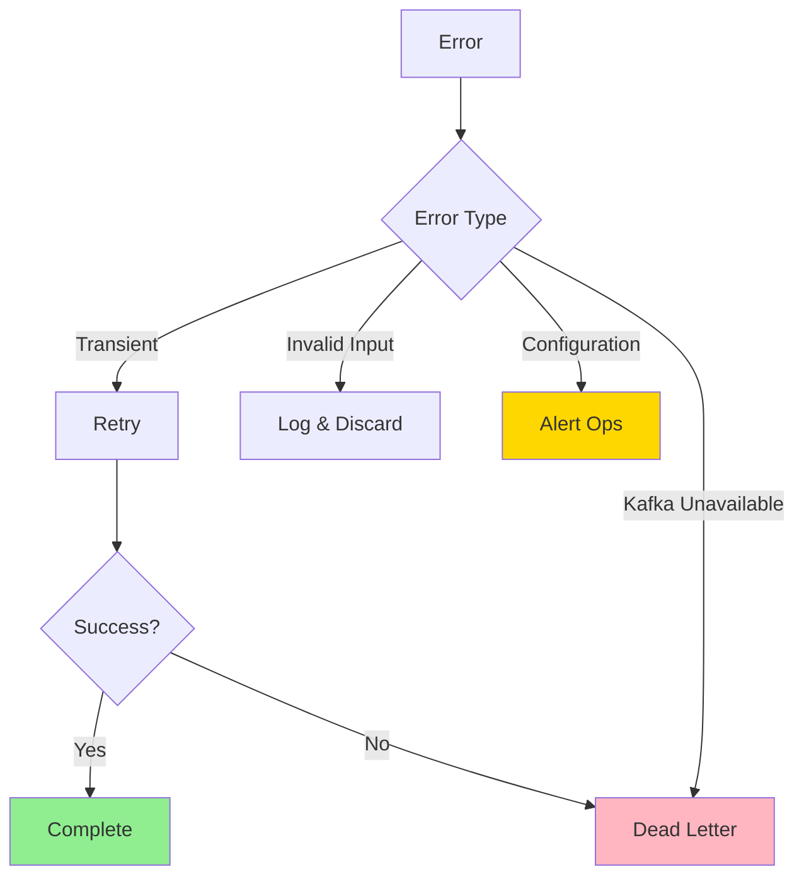

# Producer Error Handling

## Overview

This document defines error handling patterns for Azure Functions producers to ensure reliable event publishing to Kafka.

## Error Categories



## Transient Errors (Retry)

### Automatic Retry with Exponential Backoff

```csharp
[Function("inventory-http")]
[FixedDelayRetry(3, "00:00:05")] // 3 retries with 5 second delay
public async Task<HttpResponseData> Run(
    [HttpTrigger(AuthorizationLevel.Function, "post")] HttpRequestData req,
    [KafkaOutput("inventory.updated", ...)] IAsyncCollector<KafkaEventData<string>> events)
{
    // Function implementation
}
```

### Custom Retry Logic

```csharp
public async Task<bool> PublishWithRetryAsync(
    IAsyncCollector<KafkaEventData<string>> events,
    KafkaEventData<string> kafkaEvent,
    int maxRetries = 3)
{
    for (int attempt = 0; attempt < maxRetries; attempt++)
    {
        try
        {
            await events.AddAsync(kafkaEvent);
            return true;
        }
        catch (KafkaException ex) when (IsTransient(ex))
        {
            var delay = TimeSpan.FromSeconds(Math.Pow(2, attempt));
            _logger.LogWarning(ex,
                "Transient error publishing to Kafka. Retry {Attempt}/{MaxRetries} in {Delay}",
                attempt + 1, maxRetries, delay);

            if (attempt < maxRetries - 1)
            {
                await Task.Delay(delay);
            }
        }
        catch (Exception ex)
        {
            _logger.LogError(ex, "Non-retryable error publishing to Kafka");
            throw;
        }
    }

    return false;
}

private bool IsTransient(KafkaException ex)
{
    return ex.Error.Code == ErrorCode.RequestTimedOut ||
           ex.Error.Code == ErrorCode.NetworkException ||
           ex.Error.Code == ErrorCode._TRANSPORT;
}
```

## Dead Letter Queue Pattern

### Configuration

```csharp
public class DeadLetterQueue
{
    private readonly TableServiceClient _tableClient;
    private readonly BlobContainerClient _blobClient;

    public async Task SendAsync(
        string eventType,
        object originalData,
        Exception error,
        string correlationId)
    {
        var dlqEntry = new DeadLetterEntry
        {
            PartitionKey = eventType,
            RowKey = Guid.NewGuid().ToString(),
            CorrelationId = correlationId,
            OriginalData = JsonSerializer.Serialize(originalData),
            ErrorMessage = error.Message,
            ErrorStackTrace = error.StackTrace,
            Timestamp = DateTimeOffset.UtcNow,
            RetryCount = 0,
            Status = "Failed"
        };

        var tableClient = _tableClient.GetTableClient("DeadLetterQueue");
        await tableClient.CreateIfNotExistsAsync();
        await tableClient.AddEntityAsync(dlqEntry);

        _logger.LogError(error,
            "Event sent to DLQ: {EventType}, Correlation: {CorrelationId}",
            eventType, correlationId);
    }
}

public class DeadLetterEntry : ITableEntity
{
    public string PartitionKey { get; set; }
    public string RowKey { get; set; }
    public string CorrelationId { get; set; }
    public string OriginalData { get; set; }
    public string ErrorMessage { get; set; }
    public string ErrorStackTrace { get; set; }
    public int RetryCount { get; set; }
    public string Status { get; set; }
    public DateTimeOffset? Timestamp { get; set; }
    public ETag ETag { get; set; }
}
```

### Usage in Producer Function

```csharp
[Function("order-http")]
public async Task<HttpResponseData> Run(
    [HttpTrigger(AuthorizationLevel.Function, "post")] HttpRequestData req,
    [KafkaOutput("order.created", ...)] IAsyncCollector<KafkaEventData<string>> events)
{
    var correlationId = Guid.NewGuid().ToString();

    try
    {
        var payload = await req.ReadFromJsonAsync<OrderRequest>();

        var kafkaEvent = new KafkaEventData<string>
        {
            Key = payload.OrderId,
            Value = JsonSerializer.Serialize(CreateEnvelope(payload, correlationId))
        };

        var published = await PublishWithRetryAsync(events, kafkaEvent);

        if (!published)
        {
            await _deadLetterQueue.SendAsync(
                "order.created",
                payload,
                new Exception("Failed after max retries"),
                correlationId);

            return req.CreateResponse(HttpStatusCode.InternalServerError);
        }

        return req.CreateResponse(HttpStatusCode.Accepted);
    }
    catch (Exception ex)
    {
        _logger.LogError(ex, "Unexpected error in order producer");
        await _deadLetterQueue.SendAsync(
            "order.created",
            await req.ReadAsStringAsync(),
            ex,
            correlationId);

        return req.CreateResponse(HttpStatusCode.InternalServerError);
    }
}
```

## Validation Errors (Non-Retryable)

### Input Validation

```csharp
public class OrderRequestValidator
{
    public ValidationResult Validate(OrderRequest request)
    {
        var errors = new List<string>();

        if (string.IsNullOrEmpty(request.OrderId))
            errors.Add("OrderId is required");

        if (request.TotalAmount <= 0)
            errors.Add("TotalAmount must be greater than zero");

        if (string.IsNullOrEmpty(request.CustomerId))
            errors.Add("CustomerId is required");

        if (request.LineItems == null || !request.LineItems.Any())
            errors.Add("At least one line item is required");

        return new ValidationResult
        {
            IsValid = !errors.Any(),
            Errors = errors
        };
    }
}

[Function("order-http")]
public async Task<HttpResponseData> Run(
    [HttpTrigger(AuthorizationLevel.Function, "post")] HttpRequestData req,
    [KafkaOutput("order.created", ...)] IAsyncCollector<KafkaEventData<string>> events)
{
    var payload = await req.ReadFromJsonAsync<OrderRequest>();

    // Validate input
    var validationResult = _validator.Validate(payload);
    if (!validationResult.IsValid)
    {
        _logger.LogWarning(
            "Invalid request received: {Errors}",
            string.Join(", ", validationResult.Errors));

        var response = req.CreateResponse(HttpStatusCode.BadRequest);
        await response.WriteAsJsonAsync(new
        {
            errors = validationResult.Errors
        });
        return response;
    }

    // Proceed with publishing
    await events.AddAsync(CreateEvent(payload));
    return req.CreateResponse(HttpStatusCode.Accepted);
}
```

## Configuration Errors (Alert Operations)

### Detect and Alert

```csharp
try
{
    await events.AddAsync(kafkaEvent);
}
catch (KafkaException ex) when (ex.Error.Code == ErrorCode.UnknownTopicOrPart)
{
    _logger.LogCritical(ex,
        "Kafka topic does not exist: {Topic}. This is a configuration error!",
        topic);

    // Send alert to operations team
    await _alertService.SendAlertAsync(
        severity: "Critical",
        title: "Kafka Topic Configuration Error",
        message: $"Topic '{topic}' does not exist. Check Kafka cluster configuration.",
        correlationId: correlationId);

    throw; // Don't retry configuration errors
}
catch (KafkaException ex) when (ex.Error.Code == ErrorCode.AuthenticationFailure)
{
    _logger.LogCritical(ex, "Kafka authentication failed. Check connection string and credentials.");

    await _alertService.SendAlertAsync(
        severity: "Critical",
        title: "Kafka Authentication Failure",
        message: "Failed to authenticate with Kafka cluster. Check Key Vault secrets.",
        correlationId: correlationId);

    throw;
}
```

## Circuit Breaker Pattern

### Implementation

```csharp
public class KafkaCircuitBreaker
{
    private int _failureCount = 0;
    private DateTimeOffset _lastFailure = DateTimeOffset.MinValue;
    private const int FailureThreshold = 5;
    private static readonly TimeSpan CircuitOpenDuration = TimeSpan.FromMinutes(1);
    private CircuitState _state = CircuitState.Closed;

    public enum CircuitState { Closed, Open, HalfOpen }

    public async Task<bool> ExecuteAsync(
        Func<Task> operation,
        string operationName)
    {
        if (_state == CircuitState.Open)
        {
            if (DateTimeOffset.UtcNow - _lastFailure > CircuitOpenDuration)
            {
                _state = CircuitState.HalfOpen;
                _logger.LogInformation("Circuit breaker for {Operation} entering half-open state",
                    operationName);
            }
            else
            {
                _logger.LogWarning("Circuit breaker for {Operation} is open. Rejecting request.",
                    operationName);
                return false;
            }
        }

        try
        {
            await operation();

            if (_state == CircuitState.HalfOpen)
            {
                _state = CircuitState.Closed;
                _failureCount = 0;
                _logger.LogInformation("Circuit breaker for {Operation} closed", operationName);
            }

            return true;
        }
        catch (Exception ex)
        {
            _failureCount++;
            _lastFailure = DateTimeOffset.UtcNow;

            if (_failureCount >= FailureThreshold)
            {
                _state = CircuitState.Open;
                _logger.LogError(ex,
                    "Circuit breaker for {Operation} opened after {Failures} failures",
                    operationName, _failureCount);
            }

            throw;
        }
    }
}

// Usage
[Function("inventory-http")]
public async Task<HttpResponseData> Run(...)
{
    var canExecute = await _circuitBreaker.ExecuteAsync(
        async () => await events.AddAsync(kafkaEvent),
        "kafka-publish");

    if (!canExecute)
    {
        return req.CreateResponse(HttpStatusCode.ServiceUnavailable);
    }

    return req.CreateResponse(HttpStatusCode.Accepted);
}
```

## Monitoring and Alerting

### Custom Metrics

```csharp
public class ProducerMetrics
{
    private readonly TelemetryClient _telemetry;

    public void TrackPublishSuccess(string eventType, TimeSpan duration)
    {
        _telemetry.TrackMetric("producer.publish.success", 1,
            new Dictionary<string, string>
            {
                ["EventType"] = eventType
            });

        _telemetry.TrackMetric("producer.publish.duration", duration.TotalMilliseconds,
            new Dictionary<string, string>
            {
                ["EventType"] = eventType
            });
    }

    public void TrackPublishFailure(string eventType, string errorType)
    {
        _telemetry.TrackMetric("producer.publish.failure", 1,
            new Dictionary<string, string>
            {
                ["EventType"] = eventType,
                ["ErrorType"] = errorType
            });
    }

    public void TrackDeadLetter(string eventType)
    {
        _telemetry.TrackMetric("producer.deadletter.count", 1,
            new Dictionary<string, string>
            {
                ["EventType"] = eventType
            });
    }
}
```

### Alert Rules

Create alerts in Application Insights:

```kusto
// Alert: High failure rate
customMetrics
| where name == "producer.publish.failure"
| summarize FailureCount = sum(value) by bin(timestamp, 5m), tostring(customDimensions.EventType)
| where FailureCount > 10

// Alert: Dead letter queue growing
customMetrics
| where name == "producer.deadletter.count"
| summarize DLQCount = sum(value) by bin(timestamp, 15m)
| where DLQCount > 5

// Alert: Circuit breaker opened
traces
| where message contains "Circuit breaker" and message contains "opened"
| where timestamp > ago(5m)
```

## Best Practices Summary

| Pattern                | Use Case                    | Implementation                            |
| ---------------------- | --------------------------- | ----------------------------------------- |
| **Retry with Backoff** | Transient network errors    | `[FixedDelayRetry]` or custom retry logic |
| **Dead Letter Queue**  | Failed after max retries    | Table Storage for DLQ entries             |
| **Validation**         | Invalid input data          | Validate before publishing                |
| **Circuit Breaker**    | Kafka cluster down          | Stop sending, fail fast                   |
| **Alerting**           | Configuration issues        | Application Insights alerts               |
| **Metrics**            | Track success/failure rates | Custom metrics to App Insights            |
