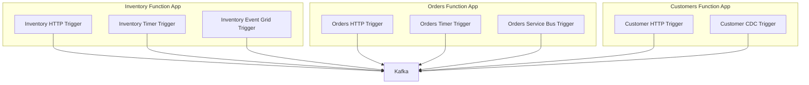
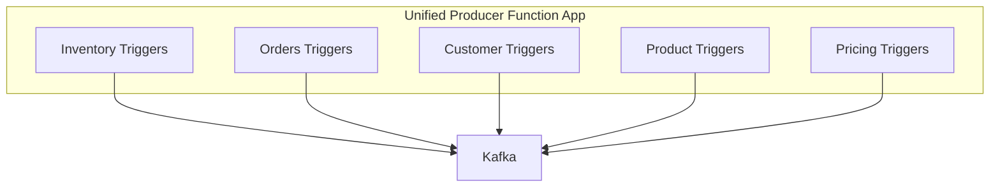
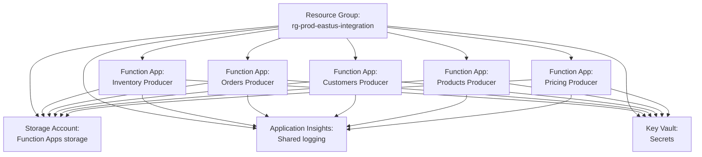

# Producer Function App Topology

## Overview

Producer Azure Functions extract data from line-of-business applications and publish events to Kafka topics. This document defines the organization and structure of producer Function Apps.

## Topology Options

### Option 1: One Function App per LOB System (Recommended)



**Pros:**

- Clear separation of concerns
- Independent deployment and scaling per LOB domain
- Isolated failures (one system down doesn't affect others)
- Easier to manage permissions and access per LOB system
- Different teams can own different Function Apps

**Cons:**

- More Function Apps to manage
- Potential for code duplication across apps
- More complex CI/CD if many apps

### Option 2: Consolidated Function App



**Pros:**

- Single deployment unit
- Shared code and utilities
- Simpler infrastructure management

**Cons:**

- All domains scale together
- Blast radius of failures larger
- Deployment coupling across domains
- May hit Function App limits with many functions

## Recommendation

**Use Option 1: One Function App per LOB System**

Each LOB domain has distinct:

- Data access patterns
- Scaling requirements
- Deployment schedules
- Ownership/teams
- Failure characteristics

Separate Function Apps provide better isolation and operational flexibility.

## Function App Naming Convention

```
func-{environment}-{region}-{lob-domain}-producer
```

Examples:

- `func-prod-eastus-inventory-producer`
- `func-prod-eastus-orders-producer`
- `func-prod-eastus-customers-producer`
- `func-prod-eastus-products-producer`
- `func-prod-eastus-pricing-producer`

## Function Naming Convention

Within each Function App:

```
{domain}-{entity}-{trigger-type}
```

Examples in Inventory Function App:

- `inventory-item-http` - HTTP endpoint for inventory updates
- `inventory-transfer-timer` - Scheduled polling for transfers
- `inventory-transaction-eventgrid` - Event Grid trigger for transactions

## Resource Organization



## Deployment Slots

Each producer Function App should have:

- **Production slot** - Live traffic
- **Staging slot** - Pre-production testing
- Slot settings for environment-specific configuration

## Configuration

### Application Settings (per Function App)

```json
{
  "KafkaBootstrapServers": "@Microsoft.KeyVault(SecretUri=https://...)",
  "KafkaConnectionString": "@Microsoft.KeyVault(SecretUri=https://...)",
  "InventoryApiBaseUrl": "https://inventory-system.contoso.com/api",
  "InventoryApiKey": "@Microsoft.KeyVault(SecretUri=https://...)",
  "APPINSIGHTS_INSTRUMENTATIONKEY": "@Microsoft.KeyVault(SecretUri=https://...)",
  "FUNCTIONS_WORKER_RUNTIME": "dotnet-isolated"
}
```

## Scalability

Each Function App scales independently based on:

- Trigger type (HTTP concurrent requests, timer schedules, event rates)
- Hosting plan (Consumption, Premium, Dedicated)
- Per-function scaling configuration

## Security

- **Managed Identity** for accessing Key Vault, Storage, Event Hubs
- **App Service Authentication** for HTTP-triggered functions (if exposed externally)
- **IP Restrictions** to limit access to internal networks
- **Secrets in Key Vault** - No connection strings in configuration
