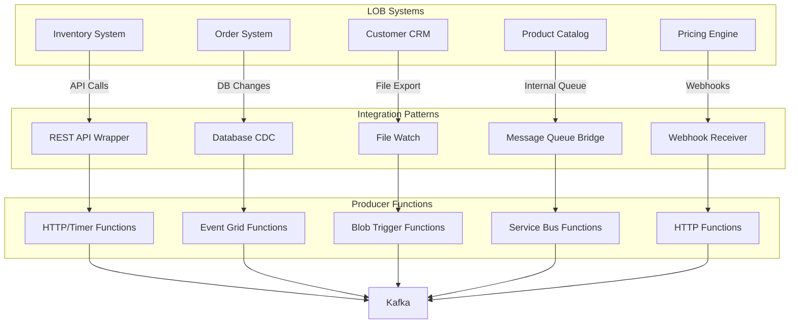
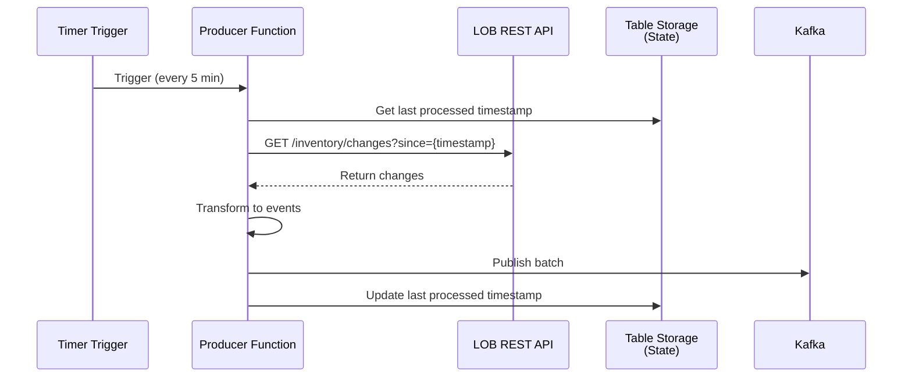
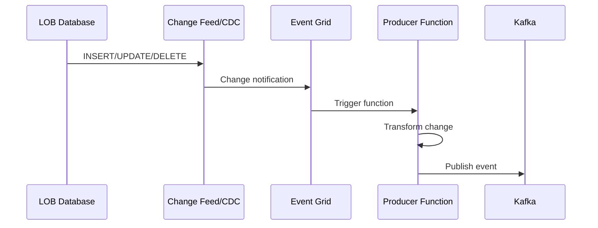
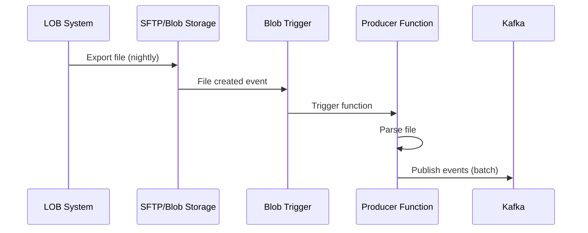
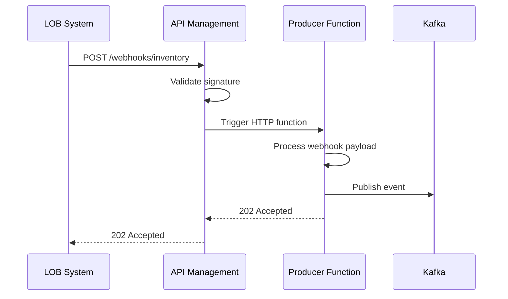
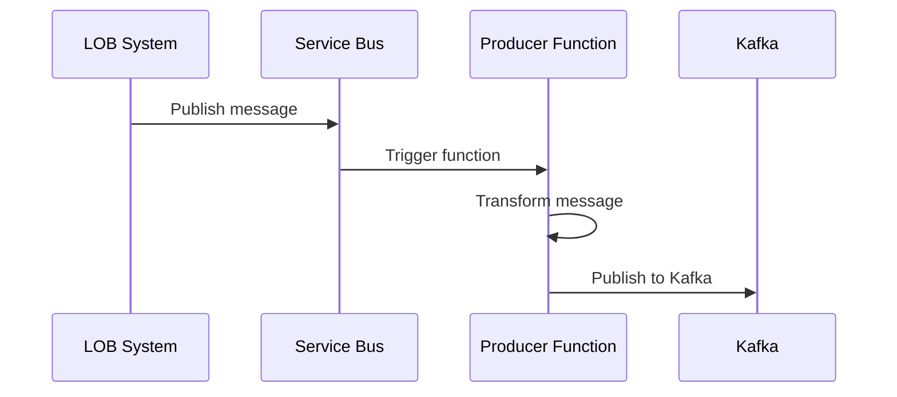

# LOB Integration Patterns

## Overview

This document defines patterns for integrating Azure Functions producers with existing line-of-business (LOB) applications to extract data and publish events to Kafka.

## Integration Architecture



## Pattern 1: REST API Wrapper (Polling)

### When to Use

- LOB exposes REST/SOAP API
- No webhook support
- Read-only access available
- Acceptable latency (minutes)

### Architecture



### Implementation

```csharp
[Function("inventory-api-poller")]
public async Task Run(
    [TimerTrigger("0 */5 * * * *")] TimerInfo timer,
    [KafkaOutput("inventory.updated", ...)] IAsyncCollector<KafkaEventData<string>> events,
    [TableInput("ProcessorState", "poller", "inventory")] ProcessorState state,
    [TableOutput("ProcessorState")] IAsyncCollector<ProcessorState> stateOut)
{
    var lastRun = state?.LastProcessedTimestamp ?? DateTimeOffset.UtcNow.AddHours(-1);

    // Call LOB API
    var response = await _httpClient.GetAsync(
        $"{_config.InventoryApiBaseUrl}/api/inventory/changes?since={lastRun:O}");
    response.EnsureSuccessStatusCode();

    var changes = await response.Content.ReadFromJsonAsync<List<InventoryChange>>();

    // Publish to Kafka
    foreach (var change in changes)
    {
        await events.AddAsync(CreateEvent(change));
    }

    // Update state
    await stateOut.AddAsync(new ProcessorState
    {
        PartitionKey = "poller",
        RowKey = "inventory",
        LastProcessedTimestamp = DateTimeOffset.UtcNow,
        LastProcessedId = changes.LastOrDefault()?.Id
    });
}
```

### Best Practices

- Use incremental queries with timestamps
- Store state in Table Storage
- Handle pagination for large result sets
- Implement exponential backoff on API errors
- Use API keys from Key Vault

## Pattern 2: Database Change Data Capture (CDC)

### When to Use

- Direct database access available
- Real-time or near-real-time required
- LOB doesn't expose events
- Azure SQL or Cosmos DB

### Architecture



### Azure SQL CDC Implementation

```csharp
[Function("customer-sql-cdc")]
public async Task Run(
    [EventGridTrigger] EventGridEvent egEvent,
    [KafkaOutput("customer.changed", ...)] IAsyncCollector<KafkaEventData<string>> events)
{
    var changeData = JsonSerializer.Deserialize<SqlChangeData>(egEvent.Data.ToString());

    // Transform CDC record to domain event
    var customerEvent = new CustomerChangedEvent
    {
        CustomerId = changeData.CustomerId,
        ChangeType = MapOperationType(changeData.OperationType),
        FirstName = changeData.FirstName,
        LastName = changeData.LastName,
        Email = changeData.Email,
        Timestamp = egEvent.EventTime
    };

    await events.AddAsync(new KafkaEventData<string>
    {
        Key = changeData.CustomerId,
        Value = JsonSerializer.Serialize(CreateEnvelope(customerEvent))
    });
}
```

### Cosmos DB Change Feed Implementation

```csharp
[Function("order-cosmos-changefeed")]
public async Task Run(
    [CosmosDBTrigger(
        databaseName: "OrdersDB",
        containerName: "Orders",
        Connection = "CosmosDbConnection",
        LeaseContainerName = "leases",
        CreateLeaseContainerIfNotExists = true
    )] IReadOnlyList<OrderDocument> documents,
    [KafkaOutput("order.changed", ...)] IAsyncCollector<KafkaEventData<string>> events)
{
    foreach (var doc in documents)
    {
        var orderEvent = new OrderChangedEvent
        {
            OrderId = doc.Id,
            CustomerId = doc.CustomerId,
            TotalAmount = doc.TotalAmount,
            Status = doc.Status,
            Timestamp = DateTimeOffset.UtcNow
        };

        await events.AddAsync(new KafkaEventData<string>
        {
            Key = doc.Id,
            Value = JsonSerializer.Serialize(CreateEnvelope(orderEvent))
        });
    }
}
```

## Pattern 3: File-Based Integration

### When to Use

- LOB exports data to files
- Legacy systems
- Batch processing acceptable
- CSV/Excel/JSON exports

### Architecture



### Implementation

```csharp
[Function("product-csv-import")]
public async Task Run(
    [BlobTrigger("imports/products/{name}.csv")] Stream blobStream,
    string name,
    [KafkaOutput("product.imported", ...)] IAsyncCollector<KafkaEventData<string>> events)
{
    using var reader = new StreamReader(blobStream);
    using var csv = new CsvReader(reader, CultureInfo.InvariantCulture);

    var records = csv.GetRecords<ProductCsvRecord>();
    var batch = new List<KafkaEventData<string>>();
    var lineNumber = 0;

    foreach (var record in records)
    {
        lineNumber++;

        try
        {
            var productEvent = new ProductImportedEvent
            {
                ProductId = record.ProductId,
                Sku = record.Sku,
                Name = record.Name,
                Price = decimal.Parse(record.Price),
                ImportFileName = name,
                LineNumber = lineNumber,
                Timestamp = DateTimeOffset.UtcNow
            };

            batch.Add(new KafkaEventData<string>
            {
                Key = record.ProductId,
                Value = JsonSerializer.Serialize(CreateEnvelope(productEvent))
            });

            // Flush batch every 100 records
            if (batch.Count >= 100)
            {
                await events.FlushAsync();
                batch.Clear();
            }
        }
        catch (Exception ex)
        {
            _logger.LogError(ex, "Failed to parse line {LineNumber} in file {FileName}",
                lineNumber, name);
            // Continue processing other records
        }
    }

    // Flush remaining
    if (batch.Any())
    {
        await events.FlushAsync();
    }

    _logger.LogInformation("Processed {LineCount} products from {FileName}",
        lineNumber, name);
}
```

## Pattern 4: Webhook Receiver

### When to Use

- LOB system supports outbound webhooks
- Real-time synchronization required
- Push-based integration preferred

### Architecture



### Implementation

```csharp
[Function("inventory-webhook")]
public async Task<HttpResponseData> Run(
    [HttpTrigger(AuthorizationLevel.Function, "post")] HttpRequestData req,
    [KafkaOutput("inventory.updated", ...)] IAsyncCollector<KafkaEventData<string>> events)
{
    // 1. Validate webhook signature
    var signature = req.Headers.GetValues("X-Hub-Signature-256").FirstOrDefault();
    var body = await req.ReadAsStringAsync();

    if (!ValidateSignature(body, signature, _config.WebhookSecret))
    {
        return req.CreateResponse(HttpStatusCode.Unauthorized);
    }

    // 2. Parse payload
    var webhook = JsonSerializer.Deserialize<InventoryWebhookPayload>(body);

    // 3. Transform to domain event
    var inventoryEvent = new InventoryUpdatedEvent
    {
        InventoryItemId = webhook.ItemId,
        Sku = webhook.Sku,
        QuantityOnHand = webhook.Quantity,
        LocationId = webhook.LocationId,
        Timestamp = DateTimeOffset.UtcNow
    };

    // 4. Publish to Kafka
    await events.AddAsync(new KafkaEventData<string>
    {
        Key = webhook.ItemId,
        Value = JsonSerializer.Serialize(CreateEnvelope(inventoryEvent))
    });

    // 5. Return 202 immediately (don't wait for Kafka ack)
    return req.CreateResponse(HttpStatusCode.Accepted);
}

private bool ValidateSignature(string payload, string signature, string secret)
{
    using var hmac = new HMACSHA256(Encoding.UTF8.GetBytes(secret));
    var hash = hmac.ComputeHash(Encoding.UTF8.GetBytes(payload));
    var expectedSignature = "sha256=" + BitConverter.ToString(hash).Replace("-", "").ToLower();
    return signature == expectedSignature;
}
```

## Pattern 5: Message Queue Bridge

### When to Use

- LOB publishes to Azure Service Bus/Event Hub
- Internal microservices architecture
- Guaranteed delivery required

### Architecture



### Implementation

```csharp
[Function("order-servicebus-bridge")]
public async Task Run(
    [ServiceBusTrigger("orders-topic", "kafka-bridge-sub")] string message,
    ServiceBusMessageActions messageActions,
    [KafkaOutput("order.created", ...)] IAsyncCollector<KafkaEventData<string>> events)
{
    try
    {
        var orderMessage = JsonSerializer.Deserialize<OrderServiceBusMessage>(message);

        var orderEvent = new OrderCreatedEvent
        {
            OrderId = orderMessage.OrderId,
            CustomerId = orderMessage.CustomerId,
            OrderDate = orderMessage.OrderDate,
            TotalAmount = orderMessage.TotalAmount,
            Timestamp = DateTimeOffset.UtcNow
        };

        await events.AddAsync(new KafkaEventData<string>
        {
            Key = orderMessage.OrderId,
            Value = JsonSerializer.Serialize(CreateEnvelope(orderEvent))
        });

        // Complete the message
        await messageActions.CompleteMessageAsync(messageActions.Message);
    }
    catch (Exception ex)
    {
        _logger.LogError(ex, "Failed to bridge Service Bus message to Kafka");
        // Dead-letter the message
        await messageActions.DeadLetterMessageAsync(
            messageActions.Message,
            "ProcessingError",
            ex.Message);
    }
}
```

## Common Integration Challenges

### Challenge 1: Rate Limiting

```csharp
private readonly SemaphoreSlim _rateLimiter = new SemaphoreSlim(10, 10); // 10 concurrent calls

public async Task<List<T>> CallApiWithRateLimitAsync<T>(string endpoint)
{
    await _rateLimiter.WaitAsync();
    try
    {
        return await _httpClient.GetFromJsonAsync<List<T>>(endpoint);
    }
    finally
    {
        _rateLimiter.Release();
    }
}
```

### Challenge 2: Pagination

```csharp
public async Task<List<T>> GetAllPagesAsync<T>(string baseUrl)
{
    var allResults = new List<T>();
    string nextUrl = baseUrl;

    while (!string.IsNullOrEmpty(nextUrl))
    {
        var response = await _httpClient.GetFromJsonAsync<PagedResponse<T>>(nextUrl);
        allResults.AddRange(response.Items);
        nextUrl = response.NextPageUrl;

        // Respect rate limits
        await Task.Delay(100);
    }

    return allResults;
}
```

### Challenge 3: Authentication

```csharp
public class LobApiClient
{
    private readonly HttpClient _httpClient;
    private readonly TokenCache _tokenCache;

    public async Task<HttpClient> GetAuthenticatedClientAsync()
    {
        var token = await _tokenCache.GetTokenAsync();
        if (token == null || token.ExpiresAt < DateTimeOffset.UtcNow)
        {
            token = await RefreshTokenAsync();
            await _tokenCache.SetTokenAsync(token);
        }

        _httpClient.DefaultRequestHeaders.Authorization =
            new AuthenticationHeaderValue("Bearer", token.AccessToken);

        return _httpClient;
    }
}
```

## Best Practices Summary

| Practice             | Description                                               |
| -------------------- | --------------------------------------------------------- |
| **Idempotency**      | Handle duplicate webhook calls, retries gracefully        |
| **State Management** | Track last processed record in Table Storage              |
| **Error Handling**   | Dead-letter failed messages, log failures                 |
| **Monitoring**       | Track API calls, publish rates, errors                    |
| **Security**         | Validate signatures, use managed identity, secure secrets |
| **Performance**      | Batch where possible, implement rate limiting             |
| **Resilience**       | Implement retries with exponential backoff                |
