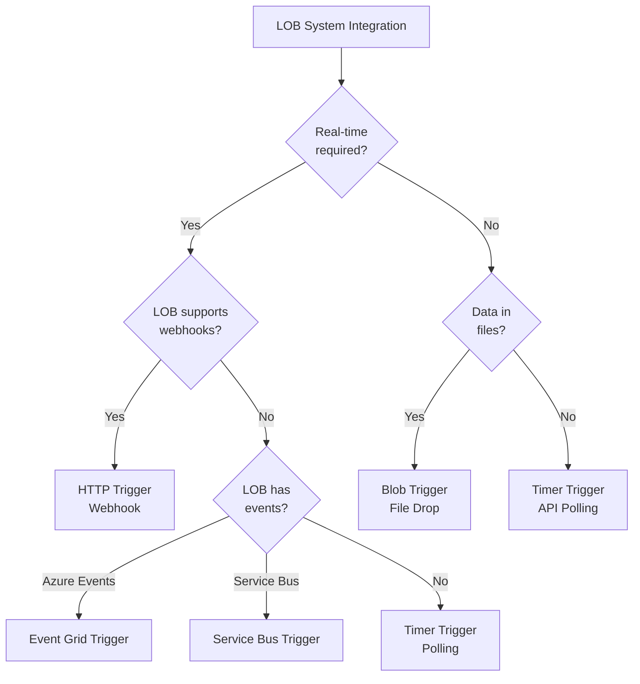

# Producer Trigger Patterns

## Overview

Producer Azure Functions use various triggers to extract data from LOB systems and publish to Kafka. This document defines when to use each trigger type and how to configure them.

## Trigger Decision Flow



## 1. HTTP Trigger (Webhook Pattern)

### When to Use

- LOB system can push data via webhooks
- External systems calling your API
- Real-time synchronization required
- LOB system supports outbound HTTP callbacks

### Configuration Example

```csharp
[Function("inventory-item-http")]
public async Task<HttpResponseData> Run(
    [HttpTrigger(AuthorizationLevel.Function, "post")] HttpRequestData req,
    [KafkaOutput("inventory.updated",
        BrokerList = "%KafkaBootstrapServers%",
        ConnectionStringSetting = "KafkaConnectionString")]
    IAsyncCollector<KafkaEventData<string>> events)
{
    // Extract data from request
    var payload = await req.ReadFromJsonAsync<InventoryUpdate>();

    // Validate and transform
    var kafkaEvent = new KafkaEventData<string>
    {
        Key = payload.InventoryItemId,
        Value = JsonSerializer.Serialize(new InventoryUpdatedEvent
        {
            InventoryItemId = payload.InventoryItemId,
            Quantity = payload.Quantity,
            Timestamp = DateTimeOffset.UtcNow
        })
    };

    await events.AddAsync(kafkaEvent);

    return req.CreateResponse(HttpStatusCode.Accepted);
}
```

### Use Cases by Domain

| Domain    | Use Case                                                  |
| --------- | --------------------------------------------------------- |
| Inventory | Webhook from warehouse management system on stock changes |
| Orders    | Webhook from e-commerce platform on new orders            |
| Customers | Webhook from CRM on customer profile updates              |
| Products  | Webhook from PIM system on product changes                |

### Security Considerations

- Use Function-level authorization keys
- Validate webhook signatures (HMAC)
- Implement rate limiting via API Management
- IP whitelist LOB system addresses

## 2. Timer Trigger (Polling Pattern)

### When to Use

- LOB system has read-only API but no webhooks
- Batch processing acceptable
- Near-real-time okay (not strict real-time)
- Cost-effective for lower-frequency changes

### Configuration Example

```csharp
[Function("inventory-transfer-timer")]
public async Task Run(
    [TimerTrigger("0 */5 * * * *")] TimerInfo timer, // Every 5 minutes
    [KafkaOutput("inventory.transfer.detected",
        BrokerList = "%KafkaBootstrapServers%",
        ConnectionStringSetting = "KafkaConnectionString")]
    IAsyncCollector<KafkaEventData<string>> events,
    [TableInput("ProcessorState", "producer-state", "inventory-transfer")]
    ProcessorState state,
    [TableOutput("ProcessorState")] IAsyncCollector<ProcessorState> stateOut)
{
    // Query LOB API for changes since last run
    var changes = await _inventoryApi.GetTransfersSince(state.LastProcessedTimestamp);

    foreach (var change in changes)
    {
        await events.AddAsync(CreateEvent(change));
    }

    // Update state
    state.LastProcessedTimestamp = DateTimeOffset.UtcNow;
    await stateOut.AddAsync(state);
}
```

### Cron Expressions

| Pattern          | Description      | Use Case                 |
| ---------------- | ---------------- | ------------------------ |
| `0 */5 * * * *`  | Every 5 minutes  | High-frequency updates   |
| `0 */15 * * * *` | Every 15 minutes | Medium-frequency updates |
| `0 0 * * * *`    | Every hour       | Low-frequency updates    |
| `0 0 2 * * *`    | Daily at 2 AM    | Nightly batch sync       |

### State Management

Store last processed timestamp in Table Storage:

```csharp
public class ProcessorState : ITableEntity
{
    public string PartitionKey { get; set; } = "producer-state";
    public string RowKey { get; set; } // Function name
    public DateTimeOffset LastProcessedTimestamp { get; set; }
    public string LastProcessedId { get; set; }
    public ETag ETag { get; set; }
    public DateTimeOffset? Timestamp { get; set; }
}
```

### Use Cases by Domain

| Domain    | Frequency        | Use Case                               |
| --------- | ---------------- | -------------------------------------- |
| Products  | Every hour       | Poll product catalog API for updates   |
| Pricing   | Every 15 minutes | Poll pricing system for price changes  |
| Inventory | Every 5 minutes  | Poll inventory levels (if no webhooks) |
| Customers | Daily at 2 AM    | Batch customer data sync               |

## 3. Event Grid Trigger (Event-Driven Pattern)

### When to Use

- LOB system supports Azure Event Grid
- Database changes via Change Data Capture (CDC)
- Azure Blob Storage changes (file uploads)
- Azure services producing events

### Configuration Example

```csharp
[Function("customer-eventgrid")]
public async Task Run(
    [EventGridTrigger] EventGridEvent eventGridEvent,
    [KafkaOutput("customer.changed",
        BrokerList = "%KafkaBootstrapServers%",
        ConnectionStringSetting = "KafkaConnectionString")]
    IAsyncCollector<KafkaEventData<string>> events)
{
    // Parse Event Grid event
    var data = JsonSerializer.Deserialize<CustomerChangeData>(
        eventGridEvent.Data.ToString());

    // Transform to domain event
    var kafkaEvent = new KafkaEventData<string>
    {
        Key = data.CustomerId,
        Value = JsonSerializer.Serialize(new CustomerChangedEvent
        {
            CustomerId = data.CustomerId,
            ChangeType = eventGridEvent.EventType,
            Timestamp = eventGridEvent.EventTime
        })
    };

    await events.AddAsync(kafkaEvent);
}
```

### Event Grid Event Schema

```json
{
  "id": "unique-event-id",
  "eventType": "Microsoft.Storage.BlobCreated",
  "subject": "/blobServices/default/containers/uploads/blobs/image.jpg",
  "eventTime": "2026-04-22T10:30:00Z",
  "data": {
    "api": "PutBlob",
    "url": "https://storage.blob.core.windows.net/uploads/image.jpg",
    "contentType": "image/jpeg"
  },
  "dataVersion": "1.0"
}
```

### Use Cases by Domain

| Domain    | Source       | Event Type                 |
| --------- | ------------ | -------------------------- |
| Customers | Azure SQL DB | Change Data Capture        |
| Orders    | Cosmos DB    | Change Feed                |
| Products  | Blob Storage | Image/document uploads     |
| Inventory | IoT Hub      | Sensor data from warehouse |

## 4. Service Bus Trigger (Message Queue Pattern)

### When to Use

- LOB system publishes to Azure Service Bus
- Internal microservices communication
- Guaranteed delivery required
- Complex routing with topics/subscriptions

### Configuration Example

```csharp
[Function("order-servicebus")]
public async Task Run(
    [ServiceBusTrigger("orders-queue", Connection = "ServiceBusConnection")]
    string queueMessage,
    [KafkaOutput("order.received",
        BrokerList = "%KafkaBootstrapServers%",
        ConnectionStringSetting = "KafkaConnectionString")]
    IAsyncCollector<KafkaEventData<string>> events)
{
    // Deserialize Service Bus message
    var orderData = JsonSerializer.Deserialize<OrderMessage>(queueMessage);

    // Transform to Kafka event
    var kafkaEvent = new KafkaEventData<string>
    {
        Key = orderData.OrderId,
        Value = JsonSerializer.Serialize(new OrderReceivedEvent
        {
            OrderId = orderData.OrderId,
            CustomerId = orderData.CustomerId,
            TotalAmount = orderData.TotalAmount,
            Timestamp = DateTimeOffset.UtcNow
        })
    };

    await events.AddAsync(kafkaEvent);
}
```

### Use Cases by Domain

| Domain        | Scenario                                          |
| ------------- | ------------------------------------------------- |
| Orders        | Order system publishes to Service Bus queue       |
| Inventory     | Internal warehouse system uses Service Bus topics |
| Notifications | Email/SMS service outputs to Service Bus          |

## 5. Blob Trigger (File-Based Pattern)

### When to Use

- LOB system exports data to file shares/blob storage
- CSV/JSON/XML file drops
- Batch file processing
- Legacy systems with SFTP/file-based integration

### Configuration Example

```csharp
[Function("product-blob")]
public async Task Run(
    [BlobTrigger("imports/{name}.csv", Connection = "StorageConnection")]
    Stream blobStream,
    string name,
    [KafkaOutput("product.imported",
        BrokerList = "%KafkaBootstrapServers%",
        ConnectionStringSetting = "KafkaConnectionString")]
    IAsyncCollector<KafkaEventData<string>> events)
{
    using var reader = new StreamReader(blobStream);
    using var csv = new CsvReader(reader, CultureInfo.InvariantCulture);

    var records = csv.GetRecords<ProductImport>();
    var batch = new List<KafkaEventData<string>>();

    foreach (var record in records)
    {
        batch.Add(new KafkaEventData<string>
        {
            Key = record.ProductId,
            Value = JsonSerializer.Serialize(new ProductImportedEvent
            {
                ProductId = record.ProductId,
                ProductName = record.Name,
                Price = record.Price,
                ImportFileName = name,
                Timestamp = DateTimeOffset.UtcNow
            })
        });

        if (batch.Count >= 100)
        {
            await events.AddRangeAsync(batch);
            batch.Clear();
        }
    }

    if (batch.Any())
    {
        await events.AddRangeAsync(batch);
    }
}
```

### Use Cases by Domain

| Domain    | File Type | Use Case                     |
| --------- | --------- | ---------------------------- |
| Products  | CSV       | Vendor product catalog drops |
| Pricing   | Excel/CSV | Nightly pricing update files |
| Customers | CSV       | Marketing list imports       |
| Inventory | JSON      | Stock count file exports     |

## Best Practices

### 1. Idempotency

All triggers should handle duplicate executions gracefully:

```csharp
// Use correlation IDs to detect duplicates
var correlationId = GenerateCorrelationId(payload);
var isDuplicate = await _deduplicationStore.CheckDuplicateAsync(correlationId);

if (!isDuplicate)
{
    await events.AddAsync(kafkaEvent);
    await _deduplicationStore.MarkProcessedAsync(correlationId);
}
```

### 2. Error Handling

```csharp
try
{
    // Process and publish
    await ProcessAndPublish(data, events);
}
catch (HttpRequestException ex) when (ex.StatusCode == HttpStatusCode.TooManyRequests)
{
    // Transient error - let Functions runtime retry
    _logger.LogWarning(ex, "Rate limited, will retry");
    throw;
}
catch (Exception ex)
{
    _logger.LogError(ex, "Failed to process {TriggerType}", triggerType);
    // Write to DLQ
    await _deadLetterQueue.SendAsync(data);
    // Don't throw - mark as handled
}
```

### 3. Batching (where applicable)

```csharp
var batch = new List<KafkaEventData<string>>();
const int batchSize = 100;

foreach (var item in items)
{
    batch.Add(CreateEvent(item));

    if (batch.Count >= batchSize)
    {
        await events.AddRangeAsync(batch);
        batch.Clear();
    }
}

if (batch.Any())
{
    await events.AddRangeAsync(batch);
}
```

### 4. Monitoring

Track trigger performance in Application Insights:

```csharp
using var activity = _activitySource.StartActivity("ProcessTrigger");
activity?.SetTag("trigger.type", "timer");
activity?.SetTag("lob.domain", "inventory");

var stopwatch = Stopwatch.StartNew();
try
{
    await ProcessData();
    _metrics.RecordProcessingTime(stopwatch.Elapsed);
    _metrics.IncrementSuccessCounter();
}
catch
{
    _metrics.IncrementFailureCounter();
    throw;
}
```

## Trigger Comparison Matrix

| Trigger Type | Latency        | Complexity | Cost              | Use When               |
| ------------ | -------------- | ---------- | ----------------- | ---------------------- |
| HTTP         | Real-time      | Low        | Pay per execution | LOB has webhooks       |
| Timer        | Minutes        | Low        | Predictable       | No webhooks available  |
| Event Grid   | Near real-time | Medium     | Pay per event     | Azure services         |
| Service Bus  | Near real-time | Medium     | Pay per message   | Internal messaging     |
| Blob         | Minutes        | Medium     | Pay per trigger   | File-based integration |
