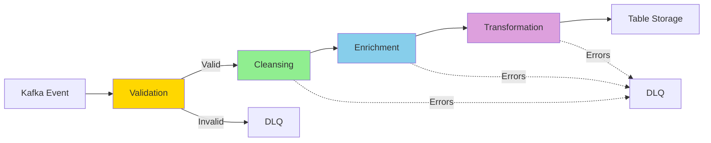
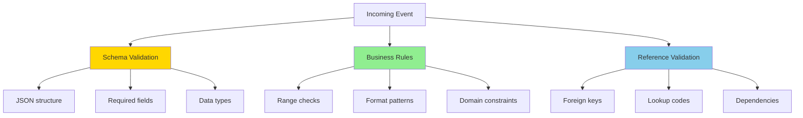

# Data Sanitization Pipeline Architecture

## Overview

The data sanitization pipeline validates, cleanses, enriches, and transforms LOB data before writing to Table Storage. This ensures data quality and consistency for CRM consumption.

## Sanitization Pipeline Stages



## Stage 1: Validation

### Purpose

Verify event structure and business rules before processing.

### Validation Categories



### Validation Implementation

```csharp
public class EventValidator
{
    private readonly ILogger _logger;
    private readonly JsonSchema _schema;
    private readonly IReferenceDataCache _referenceData;

    public ValidationResult ValidateInventoryUpdatedEvent(InventoryUpdatedEvent evt)
    {
        var errors = new List<string>();

        // Schema validation
        if (string.IsNullOrWhiteSpace(evt.InventoryItemId))
            errors.Add("InventoryItemId is required");

        if (string.IsNullOrWhiteSpace(evt.Sku))
            errors.Add("SKU is required");

        if (evt.QuantityOnHand < 0)
            errors.Add("QuantityOnHand cannot be negative");

        // Business rules
        if (evt.QuantityAvailable > evt.QuantityOnHand)
            errors.Add("QuantityAvailable cannot exceed QuantityOnHand");

        if (evt.ReorderPoint < 0)
            errors.Add("ReorderPoint cannot be negative");

        if (evt.UnitCost < 0)
            errors.Add("UnitCost cannot be negative");

        // Format validation
        if (!Regex.IsMatch(evt.Sku, @"^[A-Z0-9\-]{3,20}$"))
            errors.Add("SKU format is invalid");

        if (!string.IsNullOrEmpty(evt.Upc) && !Regex.IsMatch(evt.Upc, @"^\d{12,13}$"))
            errors.Add("UPC must be 12 or 13 digits");

        // Reference validation
        if (!_referenceData.IsValidLocation(evt.LocationId))
            errors.Add($"LocationId '{evt.LocationId}' is not valid");

        if (!_referenceData.IsValidProduct(evt.ProductId))
            errors.Add($"ProductId '{evt.ProductId}' does not exist");

        if (errors.Any())
        {
            return ValidationResult.Failure(errors);
        }

        return ValidationResult.Success();
    }
}

public record ValidationResult(bool IsValid, List<string> Errors)
{
    public static ValidationResult Success() => new(true, new List<string>());
    public static ValidationResult Failure(List<string> errors) => new(false, errors);
}
```

### Validation Rules by Domain

#### Inventory Domain

| Field               | Validation Rule                         | Error Message                                    |
| ------------------- | --------------------------------------- | ------------------------------------------------ |
| `InventoryItemId`   | Required, 3-50 chars                    | "InventoryItemId is required"                    |
| `Sku`               | Required, pattern: `^[A-Z0-9\-]{3,20}$` | "SKU format is invalid"                          |
| `Upc`               | Optional, pattern: `^\d{12,13}$`        | "UPC must be 12 or 13 digits"                    |
| `QuantityOnHand`    | >= 0                                    | "QuantityOnHand cannot be negative"              |
| `QuantityAvailable` | >= 0, <= QuantityOnHand                 | "QuantityAvailable cannot exceed QuantityOnHand" |
| `UnitCost`          | >= 0                                    | "UnitCost cannot be negative"                    |
| `LocationId`        | Must exist in reference data            | "LocationId not valid"                           |
| `ProductId`         | Must exist in reference data            | "ProductId does not exist"                       |

#### Orders Domain

| Field         | Validation Rule                                            | Error Message                       |
| ------------- | ---------------------------------------------------------- | ----------------------------------- |
| `OrderId`     | Required, 3-50 chars                                       | "OrderId is required"               |
| `CustomerId`  | Must exist in reference data                               | "CustomerId does not exist"         |
| `OrderDate`   | Not in future                                              | "OrderDate cannot be in the future" |
| `Status`      | One of: Pending, Processing, Shipped, Delivered, Cancelled | "Invalid order status"              |
| `Subtotal`    | >= 0                                                       | "Subtotal cannot be negative"       |
| `TotalAmount` | >= 0, >= Subtotal                                          | "TotalAmount must be >= Subtotal"   |
| `Email`       | Valid email format                                         | "Invalid email address"             |

#### Customers Domain

| Field        | Validation Rule                         | Error Message                 |
| ------------ | --------------------------------------- | ----------------------------- |
| `CustomerId` | Required, 3-50 chars                    | "CustomerId is required"      |
| `Email`      | Required, valid email                   | "Invalid email address"       |
| `Phone`      | Optional, pattern: `^\+?[1-9]\d{1,14}$` | "Invalid phone number format" |
| `FirstName`  | Required, 1-100 chars                   | "FirstName is required"       |
| `LastName`   | Required, 1-100 chars                   | "LastName is required"        |

## Stage 2: Cleansing

### Purpose

Normalize and standardize data formats.

### Cleansing Operations

```csharp
public class DataCleanser
{
    public void CleanseCustomerData(CustomerEvent evt)
    {
        // Trim whitespace
        evt.FirstName = evt.FirstName?.Trim();
        evt.LastName = evt.LastName?.Trim();
        evt.Email = evt.Email?.Trim();

        // Normalize email to lowercase
        evt.Email = evt.Email?.ToLowerInvariant();

        // Normalize phone number (remove non-digits, add country code)
        evt.Phone = NormalizePhoneNumber(evt.Phone);

        // Title case for names
        evt.FirstName = ToTitleCase(evt.FirstName);
        evt.LastName = ToTitleCase(evt.LastName);

        // Normalize country codes (USA, US → USA)
        evt.Country = NormalizeCountryCode(evt.Country);

        // Normalize state codes (California → CA)
        evt.State = NormalizeStateCode(evt.State);
    }

    private string NormalizePhoneNumber(string phone)
    {
        if (string.IsNullOrWhiteSpace(phone))
            return null;

        // Remove all non-digit characters
        var digits = Regex.Replace(phone, @"\D", "");

        // If 10 digits, assume US and add +1
        if (digits.Length == 10)
            return $"+1{digits}";

        // If 11 digits starting with 1, add +
        if (digits.Length == 11 && digits[0] == '1')
            return $"+{digits}";

        return $"+{digits}";
    }

    private string ToTitleCase(string value)
    {
        if (string.IsNullOrWhiteSpace(value))
            return value;

        var textInfo = CultureInfo.CurrentCulture.TextInfo;
        return textInfo.ToTitleCase(value.ToLower());
    }
}
```

### Cleansing Rules by Data Type

#### String Fields

- Trim leading/trailing whitespace
- Remove control characters
- Normalize Unicode (NFC normalization)
- Truncate to max length
- Convert to appropriate case (title, upper, lower)

#### Email Addresses

```csharp
public string CleanseEmail(string email)
{
    email = email?.Trim().ToLowerInvariant();

    // Remove comments (RFC 5322)
    email = Regex.Replace(email, @"\s*\(.*?\)\s*", "");

    // Validate format
    if (!Regex.IsMatch(email, @"^[^@\s]+@[^@\s]+\.[^@\s]+$"))
        return null;

    return email;
}
```

#### Phone Numbers

```csharp
public string CleansePhoneNumber(string phone, string defaultCountryCode = "+1")
{
    if (string.IsNullOrWhiteSpace(phone))
        return null;

    // Extract digits
    var digits = Regex.Replace(phone, @"\D", "");

    // Apply country code if missing
    if (!phone.StartsWith("+"))
    {
        if (digits.Length == 10) // US number
            return $"{defaultCountryCode}{digits}";
    }

    return $"+{digits}";
}
```

#### Addresses

```csharp
public void CleanseAddress(AddressDto address)
{
    // Normalize street abbreviations
    address.Street = NormalizeStreetAbbreviations(address.Street);

    // Title case for city
    address.City = ToTitleCase(address.City);

    // Uppercase for state/province codes
    address.State = address.State?.ToUpperInvariant();

    // Normalize zip/postal code format
    address.ZipCode = NormalizeZipCode(address.ZipCode, address.Country);

    // ISO 3166-1 alpha-3 country code
    address.Country = NormalizeCountryCode(address.Country);
}

private string NormalizeStreetAbbreviations(string street)
{
    var replacements = new Dictionary<string, string>
    {
        { @"\bSt\.?\b", "Street" },
        { @"\bAve\.?\b", "Avenue" },
        { @"\bRd\.?\b", "Road" },
        { @"\bBlvd\.?\b", "Boulevard" },
        { @"\bDr\.?\b", "Drive" },
        { @"\bLn\.?\b", "Lane" }
    };

    foreach (var (pattern, replacement) in replacements)
    {
        street = Regex.Replace(street, pattern, replacement, RegexOptions.IgnoreCase);
    }

    return street;
}
```

#### Monetary Values

```csharp
public decimal CleanseCurrency(decimal amount, int decimalPlaces = 2)
{
    // Round to specified decimal places
    return Math.Round(amount, decimalPlaces, MidpointRounding.AwayFromZero);
}
```

## Stage 3: Enrichment

### Purpose

Add derived fields, lookups, and calculated values.

### Enrichment Operations

```csharp
public class DataEnricher
{
    private readonly IProductCatalog _productCatalog;
    private readonly ICustomerLookup _customerLookup;
    private readonly IGeocoder _geocoder;

    public async Task EnrichOrderEvent(OrderEvent evt)
    {
        // Enrich customer information
        var customer = await _customerLookup.GetCustomerAsync(evt.CustomerId);
        evt.CustomerEmail = customer.Email;
        evt.CustomerName = $"{customer.FirstName} {customer.LastName}";
        evt.CustomerTier = customer.LoyaltyTier;

        // Calculate order metrics
        evt.ItemCount = evt.LineItems.Sum(li => li.Quantity);
        evt.UniqueSkuCount = evt.LineItems.Select(li => li.Sku).Distinct().Count();

        // Geocode shipping address
        if (!string.IsNullOrEmpty(evt.ShippingAddress))
        {
            var coords = await _geocoder.GeocodeAsync(evt.ShippingAddress);
            evt.ShippingLatitude = coords.Latitude;
            evt.ShippingLongitude = coords.Longitude;
        }

        // Calculate estimated delivery date
        evt.EstimatedDeliveryDate = CalculateEstimatedDelivery(
            evt.ShippingMethod,
            evt.ShippingAddress);
    }

    public async Task EnrichInventoryEvent(InventoryUpdatedEvent evt)
    {
        // Enrich product information
        var product = await _productCatalog.GetProductAsync(evt.ProductId);
        evt.ProductName = product.Name;
        evt.ProductCategory = product.CategoryName;
        evt.ProductBrand = product.Brand;

        // Calculate availability metrics
        evt.DaysOfSupply = CalculateDaysOfSupply(
            evt.QuantityAvailable,
            evt.AverageDailySales);

        // Determine reorder status
        evt.NeedsReorder = evt.QuantityAvailable <= evt.ReorderPoint;

        // Calculate inventory value
        evt.InventoryValue = evt.QuantityOnHand * evt.UnitCost;
    }
}
```

### Enrichment Types

| Enrichment Type       | Example                         | Benefit                           |
| --------------------- | ------------------------------- | --------------------------------- |
| **Lookup Enrichment** | Add customer email to order     | Denormalize for query performance |
| **Calculated Fields** | Days of supply, inventory value | Avoid calculations at query time  |
| **Geocoding**         | Lat/long from address           | Enable location-based queries     |
| **Derived Status**    | "Needs Reorder" flag            | Simplify business logic           |
| **Reference Data**    | Product name, category          | Complete context for CRM          |

## Stage 4: Transformation

### Purpose

Convert LOB schema to Table Storage schema.

### Transformation Implementation

```csharp
public class InventoryMapper
{
    public InventoryItemEntity MapToTableEntity(InventoryUpdatedEvent evt)
    {
        return new InventoryItemEntity
        {
            // Table Storage keys
            PartitionKey = evt.LocationId,
            RowKey = evt.InventoryItemId,

            // Business properties
            InventoryItemId = evt.InventoryItemId,
            Sku = evt.Sku,
            Upc = evt.Upc,
            ProductId = evt.ProductId,
            LocationId = evt.LocationId,
            QuantityOnHand = evt.QuantityOnHand,
            QuantityReserved = evt.QuantityReserved,
            QuantityAvailable = evt.QuantityAvailable,
            ReorderPoint = evt.ReorderPoint,
            UnitCost = evt.UnitCost,
            BinLocation = evt.BinLocation,
            Status = evt.Status,

            // Enriched fields
            ProductName = evt.ProductName,
            ProductCategory = evt.ProductCategory,
            DaysOfSupply = evt.DaysOfSupply,
            NeedsReorder = evt.NeedsReorder,
            InventoryValue = evt.InventoryValue,

            // Audit fields
            LastUpdated = evt.Timestamp,
            LastUpdatedBy = evt.SourceSystem,
            CorrelationId = evt.CorrelationId
        };
    }
}
```

### Transformation Patterns

#### Field Mapping

```csharp
// Direct mapping
entity.CustomerId = evt.CustomerId;

// Type conversion
entity.OrderDate = DateTimeOffset.FromUnixTimeSeconds(evt.OrderDateEpoch);

// Enum mapping
entity.Status = evt.StatusCode switch
{
    1 => "Pending",
    2 => "Processing",
    3 => "Shipped",
    _ => "Unknown"
};
```

#### Complex Object Serialization

```csharp
// Serialize address to JSON
entity.ShippingAddressJson = JsonSerializer.Serialize(new
{
    Street = evt.ShippingStreet,
    City = evt.ShippingCity,
    State = evt.ShippingState,
    ZipCode = evt.ShippingZip,
    Country = evt.ShippingCountry
});
```

#### Aggregation

```csharp
// Aggregate line items
entity.Subtotal = evt.LineItems.Sum(li => li.UnitPrice * li.Quantity);
entity.TotalQuantity = evt.LineItems.Sum(li => li.Quantity);
entity.LineItemCount = evt.LineItems.Count;
```

## Error Handling Strategy

### Validation Errors

```csharp
if (!validationResult.IsValid)
{
    _logger.LogWarning(
        "Validation failed for {EventType}, Correlation: {CorrelationId}, Errors: {Errors}",
        envelope.EventType,
        envelope.CorrelationId,
        string.Join("; ", validationResult.Errors));

    // Send to DLQ with validation errors
    await SendToDlqAsync(envelope, validationResult.Errors);

    // Metrics
    _telemetry.TrackMetric("validation.failed", 1, new Dictionary<string, string>
    {
        ["EventType"] = envelope.EventType,
        ["ErrorCount"] = validationResult.Errors.Count.ToString()
    });

    return; // Don't process further
}
```

### Cleansing/Enrichment Errors

```csharp
try
{
    await _enricher.EnrichOrderEvent(orderEvent);
}
catch (Exception ex)
{
    _logger.LogError(ex,
        "Enrichment failed for {EventType}, Correlation: {CorrelationId}",
        envelope.EventType,
        envelope.CorrelationId);

    // Continue processing with partial enrichment
    // (Enrichment is best-effort, not critical)
}
```

### Transformation Errors

```csharp
try
{
    var entity = _mapper.MapToTableEntity(orderEvent);
    await tableOutput.AddAsync(entity);
}
catch (Exception ex)
{
    _logger.LogError(ex,
        "Transformation failed for {EventType}, Correlation: {CorrelationId}",
        envelope.EventType,
        envelope.CorrelationId);

    // Send to DLQ
    await SendToDlqAsync(envelope, new[] { ex.Message });

    throw; // Let Functions retry mechanism handle
}
```

## Dead Letter Queue (DLQ) Schema

```csharp
public class DlqEntity : ITableEntity
{
    public string PartitionKey { get; set; }  // YYYY-MM-DD
    public string RowKey { get; set; }        // {correlationId}#{timestamp}
    public DateTimeOffset? Timestamp { get; set; }
    public ETag ETag { get; set; }

    // Original event
    public string OriginalEventJson { get; set; }
    public string EventType { get; set; }
    public string CorrelationId { get; set; }

    // Error details
    public string ErrorStage { get; set; }      // Validation, Cleansing, Enrichment, Transformation
    public string ErrorMessagesJson { get; set; } // JSON array of errors
    public string ExceptionMessage { get; set; }
    public string ExceptionStackTrace { get; set; }

    // Retry information
    public int RetryCount { get; set; }
    public DateTime? LastRetryAttempt { get; set; }
    public string RetryStatus { get; set; }    // Pending, Retrying, Failed, Resolved
}
```

## Performance Optimization

### Caching Reference Data

```csharp
public class ReferenceDataCache : IReferenceDataCache
{
    private readonly IMemoryCache _cache;
    private readonly ITableClient _referenceDataTable;

    public async Task<bool> IsValidLocation(string locationId)
    {
        return await _cache.GetOrCreateAsync($"location:{locationId}", async entry =>
        {
            entry.AbsoluteExpirationRelativeToNow = TimeSpan.FromHours(1);

            var exists = await _referenceDataTable.QueryAsync<LocationEntity>(
                filter: $"RowKey eq '{locationId}'")
                .AnyAsync();

            return exists;
        });
    }
}
```

### Batch Processing

```csharp
[Function("InventoryConsumerBatch")]
public async Task RunBatch(
    [KafkaTrigger(..., IsBatched = true)] KafkaEventData<string>[] kafkaEvents,
    [TableOutput(...)] IAsyncCollector<InventoryItemEntity> tableOutput)
{
    foreach (var kafkaEvent in kafkaEvents)
    {
        var envelope = JsonSerializer.Deserialize<EventEnvelope<InventoryUpdatedEvent>>(
            kafkaEvent.Value);

        // Validate
        var validationResult = _validator.ValidateInventoryUpdatedEvent(envelope.Payload);
        if (!validationResult.IsValid)
        {
            await SendToDlqAsync(envelope, validationResult.Errors);
            continue;
        }

        // Cleanse
        _cleanser.CleanseInventoryData(envelope.Payload);

        // Enrich
        await _enricher.EnrichInventoryEvent(envelope.Payload);

        // Transform and write
        var entity = _mapper.MapToTableEntity(envelope.Payload);
        await tableOutput.AddAsync(entity);
    }
}
```

## Monitoring Sanitization Pipeline

### Key Metrics

```kusto
// Validation failure rate by event type
customMetrics
| where name == "validation.failed"
| summarize FailureCount = sum(value) by tostring(customDimensions.EventType), bin(timestamp, 5m)

// DLQ growth rate
StorageTableLogs
| where OperationName == "PutEntity"
| where TableName startswith "dlq"
| summarize DlqWrites = count() by bin(TimeGenerated, 5m)

// Average enrichment duration
customMetrics
| where name == "enrichment.duration"
| summarize avg(value), percentile(value, 95) by tostring(customDimensions.EventType)
```

## Best Practices Summary

| Practice                  | Description                                   |
| ------------------------- | --------------------------------------------- |
| **Fail Fast**             | Validate early, before expensive operations   |
| **Cache Reference Data**  | Avoid repeated lookups                        |
| **Idempotent Processing** | Same input → same output                      |
| **Graceful Degradation**  | Continue with partial enrichment              |
| **Detailed Logging**      | Log validation errors for debugging           |
| **Metrics Tracking**      | Monitor validation/cleansing/enrichment rates |
| **DLQ for Recovery**      | Enable manual review and reprocessing         |
