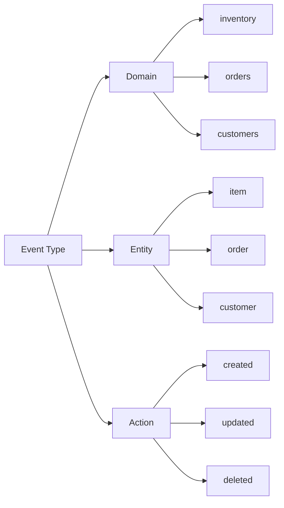
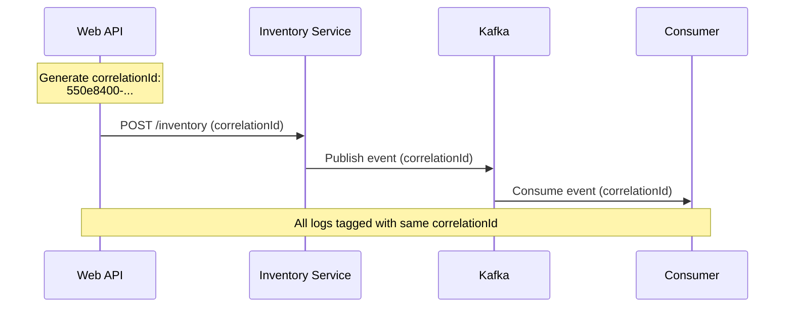
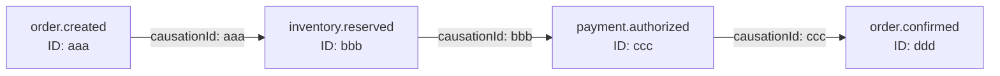

# Event Envelope Schema

## Overview

All events published to Kafka must use a consistent envelope format. This envelope provides metadata and context for event processing, schema evolution, and tracing.

## JSON Schema Definition

```json
{
  "$schema": "http://json-schema.org/draft-07/schema#",
  "title": "Event Envelope",
  "description": "Standard envelope for all LOB events published to Kafka",
  "type": "object",
  "required": [
    "eventType",
    "schemaVersion",
    "correlationId",
    "timestamp",
    "sourceSystem",
    "payload"
  ],
  "properties": {
    "eventType": {
      "type": "string",
      "description": "Fully qualified event type (domain.entity.action)",
      "pattern": "^[a-z]+\\.[a-z]+\\.[a-z]+$",
      "examples": ["inventory.item.updated", "order.order.created"]
    },
    "schemaVersion": {
      "type": "string",
      "description": "Version of the payload schema",
      "pattern": "^\\d+\\.\\d+$",
      "examples": ["1.0", "2.1"]
    },
    "correlationId": {
      "type": "string",
      "description": "Unique identifier for tracing across services",
      "format": "uuid"
    },
    "causationId": {
      "type": "string",
      "description": "ID of the event that caused this event (optional)",
      "format": "uuid"
    },
    "timestamp": {
      "type": "string",
      "description": "ISO 8601 timestamp when event was created",
      "format": "date-time"
    },
    "sourceSystem": {
      "type": "string",
      "description": "System that originated the event",
      "examples": ["inventory-api", "order-service", "customer-crm"]
    },
    "userId": {
      "type": "string",
      "description": "User who triggered the event (if applicable)"
    },
    "metadata": {
      "type": "object",
      "description": "Additional context-specific metadata",
      "additionalProperties": true
    },
    "payload": {
      "type": "object",
      "description": "Domain-specific event data"
    }
  }
}
```

## C# Implementation

```csharp
public class EventEnvelope<TPayload>
{
    [JsonPropertyName("eventType")]
    [JsonRequired]
    public string EventType { get; set; }

    [JsonPropertyName("schemaVersion")]
    [JsonRequired]
    public string SchemaVersion { get; set; }

    [JsonPropertyName("correlationId")]
    [JsonRequired]
    public string CorrelationId { get; set; }

    [JsonPropertyName("causationId")]
    public string? CausationId { get; set; }

    [JsonPropertyName("timestamp")]
    [JsonRequired]
    public DateTimeOffset Timestamp { get; set; }

    [JsonPropertyName("sourceSystem")]
    [JsonRequired]
    public string SourceSystem { get; set; }

    [JsonPropertyName("userId")]
    public string? UserId { get; set; }

    [JsonPropertyName("metadata")]
    public Dictionary<string, object>? Metadata { get; set; }

    [JsonPropertyName("payload")]
    [JsonRequired]
    public TPayload Payload { get; set; }
}
```

## Example Event

```json
{
  "eventType": "inventory.item.updated",
  "schemaVersion": "1.0",
  "correlationId": "550e8400-e29b-41d4-a716-446655440000",
  "causationId": "660e8400-e29b-41d4-a716-446655440111",
  "timestamp": "2026-04-22T14:30:00Z",
  "sourceSystem": "inventory-api",
  "userId": "user@contoso.com",
  "metadata": {
    "region": "east-us",
    "environment": "production"
  },
  "payload": {
    "inventoryItemId": "INV-12345",
    "sku": "WIDGET-001",
    "quantityOnHand": 150,
    "quantityReserved": 25,
    "locationId": "WAREHOUSE-01",
    "lastUpdatedBy": "system"
  }
}
```

## Event Type Naming Convention

Format: `{domain}.{entity}.{action}`



### Examples by Domain

| Domain    | Event Type                   | Description                  |
| --------- | ---------------------------- | ---------------------------- |
| inventory | `inventory.item.created`     | New inventory item added     |
| inventory | `inventory.item.updated`     | Inventory quantity changed   |
| inventory | `inventory.transfer.created` | Stock transfer initiated     |
| orders    | `order.order.created`        | New order placed             |
| orders    | `order.payment.captured`     | Payment processed            |
| orders    | `order.shipment.shipped`     | Order shipped                |
| customers | `customer.customer.created`  | New customer registered      |
| customers | `customer.address.updated`   | Customer address changed     |
| products  | `product.product.created`    | New product added to catalog |
| pricing   | `pricing.price.updated`      | Price changed for product    |

## Schema Versioning

### Version Format

Use semantic versioning: `MAJOR.MINOR`

- **MAJOR**: Incremented for breaking changes
- **MINOR**: Incremented for backward-compatible additions

### Backward-Compatible Changes (MINOR)

✅ Allowed:

- Adding optional fields
- Adding new enum values
- Relaxing validation rules

```json
{
  "eventType": "inventory.item.updated",
  "schemaVersion": "1.1", // Minor increment
  "payload": {
    "inventoryItemId": "INV-12345",
    "sku": "WIDGET-001",
    "quantityOnHand": 150,
    "binLocation": "A-12-5" // New optional field
  }
}
```

### Breaking Changes (MAJOR)

❌ Requires major version bump:

- Removing required fields
- Changing field types
- Renaming fields
- Making optional fields required

```json
{
  "eventType": "inventory.item.updated",
  "schemaVersion": "2.0", // Major increment
  "payload": {
    "inventoryItemId": "INV-12345",
    "sku": "WIDGET-001",
    "stockLevel": {
      // Breaking: nested structure instead of flat
      "onHand": 150,
      "reserved": 25,
      "available": 125
    }
  }
}
```

## Correlation and Causation

### Correlation ID

Tracks a single request across multiple services:



### Causation ID

Links events in a chain (event that caused this event):



## Metadata Best Practices

### Common Metadata Fields

```csharp
public class EventMetadata
{
    public string Region { get; set; }
    public string Environment { get; set; }
    public string TenantId { get; set; }
    public string IpAddress { get; set; }
    public string UserAgent { get; set; }
    public Dictionary<string, string> CustomDimensions { get; set; }
}
```

### Example with Rich Metadata

```json
{
  "eventType": "order.order.created",
  "schemaVersion": "1.0",
  "correlationId": "550e8400-e29b-41d4-a716-446655440000",
  "timestamp": "2026-04-22T14:30:00Z",
  "sourceSystem": "order-api",
  "userId": "customer@example.com",
  "metadata": {
    "region": "east-us",
    "environment": "production",
    "channel": "web",
    "deviceType": "mobile",
    "ipAddress": "192.168.1.100",
    "userAgent": "Mozilla/5.0...",
    "tenantId": "tenant-123",
    "featureFlags": ["new-checkout", "express-shipping"]
  },
  "payload": {
    "orderId": "ORD-12345",
    "customerId": "CUST-67890",
    "totalAmount": 99.99
  }
}
```

## Validation

### Producer-Side Validation

```csharp
public static class EventEnvelopeValidator
{
    public static ValidationResult Validate<TPayload>(EventEnvelope<TPayload> envelope)
    {
        var errors = new List<string>();

        if (string.IsNullOrWhiteSpace(envelope.EventType))
            errors.Add("EventType is required");
        else if (!IsValidEventType(envelope.EventType))
            errors.Add($"EventType '{envelope.EventType}' does not match pattern domain.entity.action");

        if (string.IsNullOrWhiteSpace(envelope.SchemaVersion))
            errors.Add("SchemaVersion is required");
        else if (!Regex.IsMatch(envelope.SchemaVersion, @"^\d+\.\d+$"))
            errors.Add($"SchemaVersion '{envelope.SchemaVersion}' must be in format X.Y");

        if (string.IsNullOrWhiteSpace(envelope.CorrelationId))
            errors.Add("CorrelationId is required");

        if (envelope.Timestamp == default)
            errors.Add("Timestamp is required");

        if (string.IsNullOrWhiteSpace(envelope.SourceSystem))
            errors.Add("SourceSystem is required");

        if (envelope.Payload == null)
            errors.Add("Payload is required");

        return new ValidationResult
        {
            IsValid = !errors.Any(),
            Errors = errors
        };
    }

    private static bool IsValidEventType(string eventType)
    {
        return Regex.IsMatch(eventType, @"^[a-z]+\.[a-z]+\.[a-z]+$");
    }
}
```

### Consumer-Side Validation

```csharp
public async Task ProcessEventAsync(string eventJson)
{
    EventEnvelope<JsonElement> envelope;

    try
    {
        envelope = JsonSerializer.Deserialize<EventEnvelope<JsonElement>>(eventJson);
    }
    catch (JsonException ex)
    {
        _logger.LogError(ex, "Failed to deserialize event envelope");
        throw new InvalidEventException("Invalid JSON format", ex);
    }

    var validationResult = EventEnvelopeValidator.Validate(envelope);
    if (!validationResult.IsValid)
    {
        _logger.LogError("Event envelope validation failed: {Errors}",
            string.Join(", ", validationResult.Errors));
        throw new InvalidEventException($"Validation failed: {string.Join(", ", validationResult.Errors)}");
    }

    // Check schema version compatibility
    if (!IsCompatibleVersion(envelope.SchemaVersion))
    {
        _logger.LogWarning("Unsupported schema version: {Version}", envelope.SchemaVersion);
        throw new UnsupportedSchemaVersionException(envelope.SchemaVersion);
    }

    // Process payload based on eventType
    await ProcessPayloadAsync(envelope);
}
```

## Helper Methods

### Creating Envelopes

```csharp
public static class EventEnvelopeFactory
{
    public static EventEnvelope<TPayload> Create<TPayload>(
        string eventType,
        TPayload payload,
        string? correlationId = null,
        string? causationId = null,
        string? userId = null,
        Dictionary<string, object>? metadata = null)
    {
        return new EventEnvelope<TPayload>
        {
            EventType = eventType,
            SchemaVersion = GetSchemaVersion<TPayload>(),
            CorrelationId = correlationId ?? Activity.Current?.Id ?? Guid.NewGuid().ToString(),
            CausationId = causationId,
            Timestamp = DateTimeOffset.UtcNow,
            SourceSystem = GetSourceSystem(),
            UserId = userId,
            Metadata = metadata,
            Payload = payload
        };
    }

    private static string GetSchemaVersion<TPayload>()
    {
        var versionAttr = typeof(TPayload).GetCustomAttribute<SchemaVersionAttribute>();
        return versionAttr?.Version ?? "1.0";
    }

    private static string GetSourceSystem()
    {
        return Environment.GetEnvironmentVariable("SOURCE_SYSTEM") ?? "unknown";
    }
}

[AttributeUsage(AttributeTargets.Class)]
public class SchemaVersionAttribute : Attribute
{
    public string Version { get; }
    public SchemaVersionAttribute(string version) => Version = version;
}
```

### Usage

```csharp
[SchemaVersion("1.0")]
public class InventoryUpdatedEvent
{
    public string InventoryItemId { get; set; }
    public string Sku { get; set; }
    public int QuantityOnHand { get; set; }
}

// Create envelope
var envelope = EventEnvelopeFactory.Create(
    "inventory.item.updated",
    new InventoryUpdatedEvent
    {
        InventoryItemId = "INV-12345",
        Sku = "WIDGET-001",
        QuantityOnHand = 150
    },
    correlationId: "550e8400-e29b-41d4-a716-446655440000"
);

// Serialize and publish
var kafkaEvent = new KafkaEventData<string>
{
    Key = "INV-12345",
    Value = JsonSerializer.Serialize(envelope)
};
```
