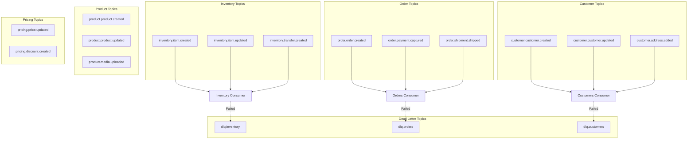

# Kafka Topic Map

## Overview

This document defines all Kafka topics used in the system, including naming conventions, partition strategies, retention policies, and replication settings.

## Topic Naming Convention

Format: `{domain}.{entity}.{action}`

All lowercase, dot-separated, descriptive

## Topic Inventory

### Inventory Domain Topics

| Topic Name                       | Partition Key   | Partitions | Retention | Replication | Description                        |
| -------------------------------- | --------------- | ---------- | --------- | ----------- | ---------------------------------- |
| `inventory.item.created`         | inventoryItemId | 12         | 7 days    | 3           | New inventory item added           |
| `inventory.item.updated`         | inventoryItemId | 12         | 7 days    | 3           | Inventory quantity/details changed |
| `inventory.item.deleted`         | inventoryItemId | 12         | 7 days    | 3           | Inventory item removed             |
| `inventory.transfer.created`     | transferId      | 6          | 7 days    | 3           | Stock transfer initiated           |
| `inventory.transfer.shipped`     | transferId      | 6          | 7 days    | 3           | Stock transfer in transit          |
| `inventory.transfer.received`    | transferId      | 6          | 7 days    | 3           | Stock transfer completed           |
| `inventory.transaction.recorded` | inventoryItemId | 12         | 30 days   | 3           | Inventory transaction logged       |

### Orders Domain Topics

| Topic Name                 | Partition Key | Partitions | Retention | Replication | Description           |
| -------------------------- | ------------- | ---------- | --------- | ----------- | --------------------- |
| `order.order.created`      | orderId       | 24         | 30 days   | 3           | New order placed      |
| `order.order.updated`      | orderId       | 24         | 30 days   | 3           | Order details changed |
| `order.order.cancelled`    | orderId       | 24         | 30 days   | 3           | Order cancelled       |
| `order.payment.authorized` | orderId       | 24         | 30 days   | 3           | Payment authorized    |
| `order.payment.captured`   | orderId       | 24         | 30 days   | 3           | Payment captured      |
| `order.payment.refunded`   | orderId       | 24         | 30 days   | 3           | Payment refunded      |
| `order.shipment.created`   | shipmentId    | 12         | 30 days   | 3           | Shipment created      |
| `order.shipment.shipped`   | shipmentId    | 12         | 30 days   | 3           | Shipment dispatched   |
| `order.shipment.delivered` | shipmentId    | 12         | 30 days   | 3           | Shipment delivered    |

### Customers Domain Topics

| Topic Name                  | Partition Key | Partitions | Retention | Replication | Description                     |
| --------------------------- | ------------- | ---------- | --------- | ----------- | ------------------------------- |
| `customer.customer.created` | customerId    | 12         | 30 days   | 3           | New customer registered         |
| `customer.customer.updated` | customerId    | 12         | 30 days   | 3           | Customer profile changed        |
| `customer.customer.deleted` | customerId    | 12         | 30 days   | 3           | Customer account deleted (GDPR) |
| `customer.address.added`    | customerId    | 12         | 30 days   | 3           | New address added               |
| `customer.address.updated`  | customerId    | 12         | 30 days   | 3           | Address details changed         |
| `customer.contact.recorded` | customerId    | 12         | 90 days   | 3           | Customer contact logged         |

### Products Domain Topics

| Topic Name                     | Partition Key | Partitions | Retention | Replication | Description                    |
| ------------------------------ | ------------- | ---------- | --------- | ----------- | ------------------------------ |
| `product.product.created`      | productId     | 12         | 30 days   | 3           | New product added to catalog   |
| `product.product.updated`      | productId     | 12         | 30 days   | 3           | Product details changed        |
| `product.product.discontinued` | productId     | 12         | 30 days   | 3           | Product marked as discontinued |
| `product.category.created`     | categoryId    | 6          | 30 days   | 3           | New product category           |
| `product.media.uploaded`       | productId     | 12         | 30 days   | 3           | Product image/video uploaded   |

### Pricing Domain Topics

| Topic Name                 | Partition Key | Partitions | Retention | Replication | Description                |
| -------------------------- | ------------- | ---------- | --------- | ----------- | -------------------------- |
| `pricing.price.updated`    | productId     | 12         | 90 days   | 3           | Product price changed      |
| `pricing.discount.created` | discountId    | 6          | 30 days   | 3           | Discount/promotion created |
| `pricing.discount.applied` | orderId       | 12         | 30 days   | 3           | Discount applied to order  |

## Dead Letter Topics

| Topic Name      | Partition Key | Partitions | Retention | Replication | Description             |
| --------------- | ------------- | ---------- | --------- | ----------- | ----------------------- |
| `dlq.inventory` | correlationId | 6          | 30 days   | 3           | Failed inventory events |
| `dlq.orders`    | correlationId | 6          | 30 days   | 3           | Failed order events     |
| `dlq.customers` | correlationId | 6          | 30 days   | 3           | Failed customer events  |
| `dlq.products`  | correlationId | 6          | 30 days   | 3           | Failed product events   |
| `dlq.pricing`   | correlationId | 6          | 30 days   | 3           | Failed pricing events   |

## Topic Architecture



## Partition Strategy

### By Entity ID (Recommended)

Events for the same entity always go to the same partition, preserving order:

```
partition = hash(entityId) % partition_count
```

Example:

- All events for `orderId="ORD-12345"` → Partition 7
- All events for `customerId="CUST-67890"` → Partition 3

### Benefits

- Ordering guaranteed per entity
- Scalable by adding partitions
- Even distribution (assuming good key distribution)

### Partition Count Guidelines

| Expected Throughput   | Partition Count | Reasoning                            |
| --------------------- | --------------- | ------------------------------------ |
| < 100 events/sec      | 6 partitions    | Low volume, simple management        |
| 100-1000 events/sec   | 12 partitions   | Medium volume, room to grow          |
| 1000-10000 events/sec | 24 partitions   | High volume, parallel processing     |
| > 10000 events/sec    | 48+ partitions  | Very high volume, horizontal scaling |

## Retention Policies

### Time-Based Retention

| Topic Type           | Retention | Reason                         |
| -------------------- | --------- | ------------------------------ |
| Transactional events | 7 days    | Short-lived, consumed quickly  |
| Business events      | 30 days   | Medium-term replay capability  |
| Audit events         | 90 days   | Compliance and troubleshooting |
| DLQ topics           | 30 days   | Investigation and recovery     |

### Log Compaction (Not Recommended for This Use Case)

Log compaction keeps only the latest value per key. **Not recommended** because:

- We need full event history for audit
- Events represent state changes, not current state
- Replay scenarios require all events

## Replication Factor

**Recommended: 3 replicas**

- Tolerates 2 broker failures
- Standard for production Kafka clusters
- Balances availability and storage cost

```
In-Sync Replicas (ISR) >= 2
```

## Topic Configuration (Kafka Properties)

### Standard Configuration

```properties
# Replication
replication.factor=3
min.insync.replicas=2

# Retention
retention.ms=604800000  # 7 days for most topics
segment.ms=86400000     # 1 day segments

# Performance
compression.type=snappy
max.message.bytes=1048576  # 1MB

# Cleanup
cleanup.policy=delete
delete.retention.ms=86400000  # 1 day
```

### Azure Event Hubs for Kafka Configuration

```json
{
  "partitionCount": 12,
  "messageRetentionInDays": 7,
  "captureEnabled": false,
  "captureEncodingFormat": "Avro",
  "status": "Active"
}
```

## Topic Creation

### Using Kafka CLI

```bash
kafka-topics.sh --create \
  --topic inventory.item.updated \
  --partitions 12 \
  --replication-factor 3 \
  --config retention.ms=604800000 \
  --config compression.type=snappy \
  --bootstrap-server kafka-broker:9092
```

### Using Azure Event Hubs

```bash
az eventhubs eventhub create \
  --resource-group rg-kafka-integration \
  --namespace-name kafka-namespace \
  --name inventory.item.updated \
  --partition-count 12 \
  --message-retention 7
```

### Using Infrastructure as Code (Bicep)

```bicep
resource eventHub 'Microsoft.EventHub/namespaces/eventhubs@2021-11-01' = {
  parent: eventHubNamespace
  name: 'inventory.item.updated'
  properties: {
    partitionCount: 12
    messageRetentionInDays: 7
  }
}
```

## Consumer Group Strategy

### One Consumer Group per Consumer Service

```
inventory.item.updated
  ├─ consumer-group: inventory-writer    (writes to Table Storage)
  ├─ consumer-group: crm-sync           (syncs to CRM)
  └─ consumer-group: analytics          (streams to analytics platform)
```

### Consumer Group Naming

```
{service-name}-{purpose}
```

Examples:

- `inventory-writer`
- `orders-writer`
- `customers-writer`
- `crm-sync`
- `analytics-stream`

## Monitoring and Metrics

### Key Metrics per Topic

- **Message rate** (messages/sec)
- **Byte rate** (MB/sec)
- **Consumer lag** (messages behind)
- **Partition distribution** (messages per partition)
- **Error rate** (failed publishes/consumes)

### Application Insights Queries

```kusto
// Topic throughput
customMetrics
| where name == "kafka.topic.messages"
| summarize MessageRate = sum(value) by bin(timestamp, 1m), tostring(customDimensions.Topic)

// Consumer lag
customMetrics
| where name == "kafka.consumer.lag"
| summarize avg(value), max(value) by tostring(customDimensions.Topic), tostring(customDimensions.ConsumerGroup)
```

## Topic Lifecycle Management

### Adding New Topics

1. Define in this document
2. Create in dev/staging environments
3. Test producers and consumers
4. Create in production
5. Monitor for 24 hours

### Deprecating Topics

1. Announce deprecation (30-day notice)
2. Create replacement topic
3. Dual-write to both topics
4. Migrate consumers
5. Stop writing to old topic
6. Delete after retention period expires

### Renaming Topics

**Do not rename topics in place.** Instead:

1. Create new topic with desired name
2. Dual-write to both topics
3. Migrate all consumers
4. Deprecate old topic
